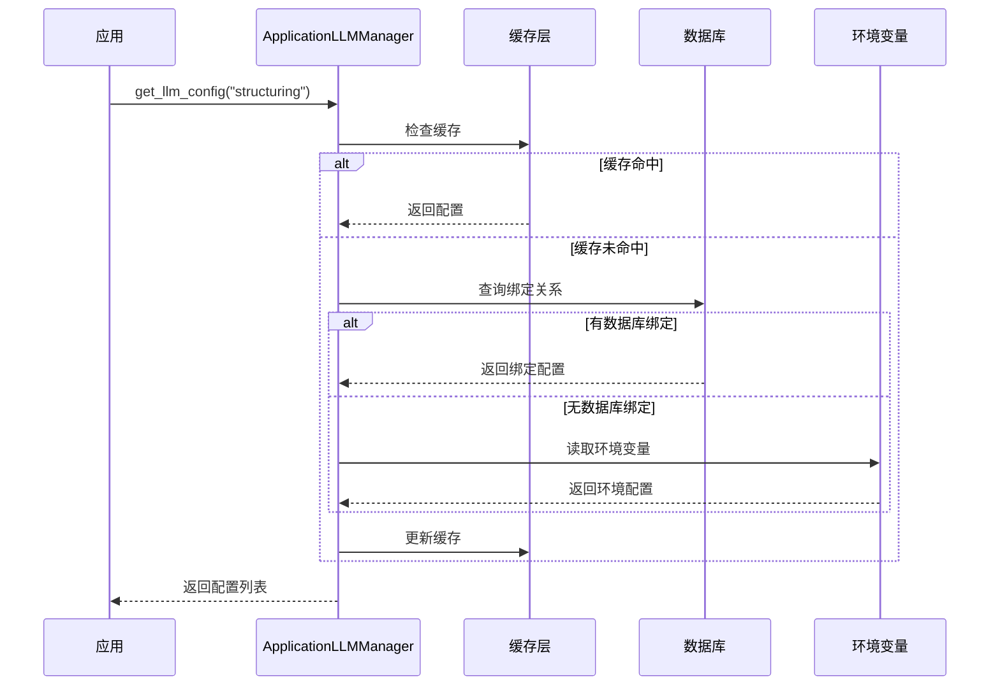
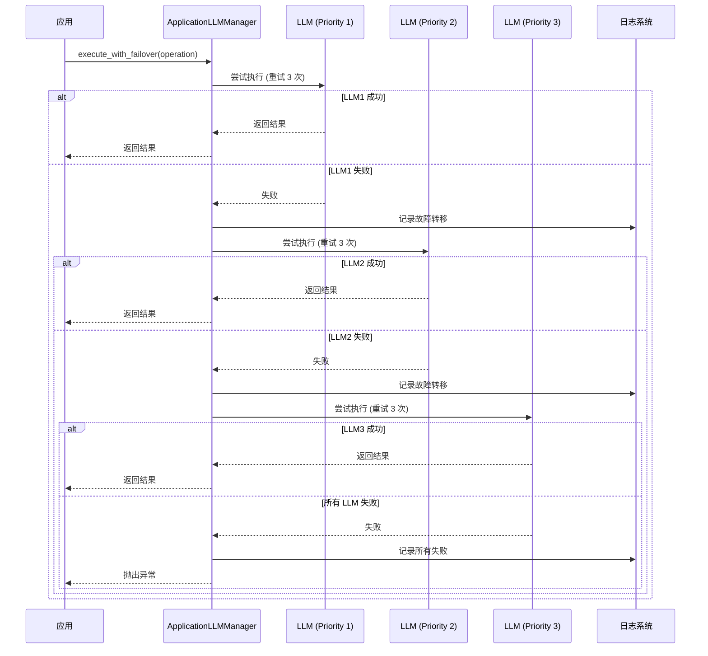
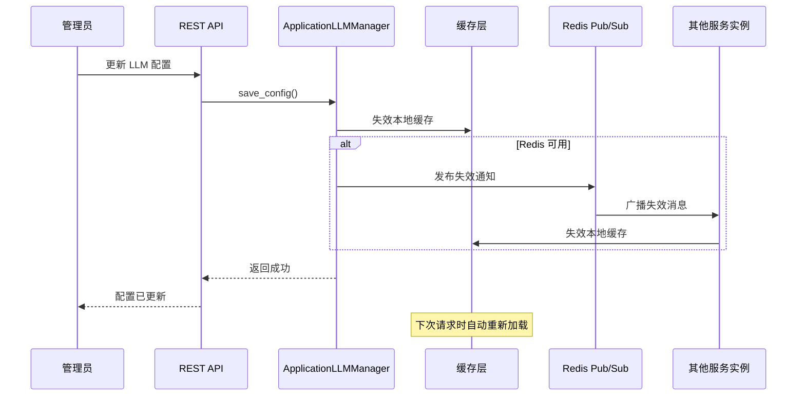

# LLM-应用绑定系统架构说明

**文档版本**: 1.0  
**最后更新**: 2026-03-03  
**维护者**: 开发团队  
**相关 Spec**: `.kiro/specs/llm-application-binding/`

---

## 📋 概述

LLM-应用绑定系统是 SuperInsight 平台的架构级升级，实现了 LLM 配置与应用之间的灵活多对多关系，支持优先级故障转移、热重载和多租户隔离。

### 核心价值

- **灵活性**: 每个应用可配置多个 LLM 提供商（主用 + 备用）
- **可靠性**: 自动故障转移，确保服务高可用
- **可维护性**: 配置热重载，无需重启服务
- **可扩展性**: 支持新应用和新 LLM 提供商的快速接入

---

## 🏗️ 系统架构

### 架构层次

```
┌─────────────────────────────────────────────────────────────┐
│                      应用层 (Applications)                    │
│  ┌──────────┐  ┌──────────┐  ┌──────────┐  ┌──────────┐   │
│  │数据结构化│  │知识图谱  │  │AI助手    │  │RAG Agent │   │
│  └────┬─────┘  └────┬─────┘  └────┬─────┘  └────┬─────┘   │
└───────┼─────────────┼─────────────┼─────────────┼──────────┘
        │             │             │             │
        └─────────────┴─────────────┴─────────────┘
                            │
        ┌───────────────────▼───────────────────┐
        │    配置检索服务 (Config Retrieval)     │
        │  ┌─────────────────────────────────┐  │
        │  │  ApplicationLLMManager          │  │
        │  │  - get_llm_config()             │  │
        │  │  - failover logic               │  │
        │  │  - cache management             │  │
        │  └─────────────────────────────────┘  │
        └───────────────────┬───────────────────┘
                            │
        ┌───────────────────▼───────────────────┐
        │      缓存层 (Cache Layer)              │
        │  ┌──────────────┐  ┌──────────────┐  │
        │  │ 本地内存缓存  │  │ Redis 缓存   │  │
        │  │ (TTL 300s)   │  │ (可选)       │  │
        │  └──────────────┘  └──────────────┘  │
        └───────────────────┬───────────────────┘
                            │
        ┌───────────────────▼───────────────────┐
        │      数据层 (Data Layer)               │
        │  ┌──────────────────────────────────┐ │
        │  │  llm_configs                     │ │
        │  │  llm_applications                │ │
        │  │  llm_application_bindings        │ │
        │  └──────────────────────────────────┘ │
        └────────────────────────────────────────┘
```

### 核心组件

#### 1. 应用注册表 (Application Registry)

**职责**: 管理所有使用 LLM 的应用

**数据模型**:
```python
class LLMApplication:
    id: UUID
    code: str  # 唯一标识，如 "structuring"
    name: str  # 显示名称，如 "数据结构化"
    description: str
    llm_usage_pattern: str  # 使用模式描述
    is_active: bool
```

**初始应用清单**:
- `structuring` - 数据结构化（SchemaInferrer + EntityExtractor）
- `knowledge_graph` - 知识图谱构建
- `ai_assistant` - AI 智能助手
- `semantic_analysis` - 语义分析服务
- `rag_agent` - RAG 智能体
- `text_to_sql` - 文本转 SQL

#### 2. LLM 配置管理 (LLM Config Management)

**职责**: 管理 LLM 提供商配置

**数据模型**:
```python
class LLMConfig:
    id: UUID
    name: str
    provider: str  # openai, azure, anthropic, ollama, custom
    api_key: str  # 加密存储
    base_url: str
    model_name: str
    parameters: dict  # JSON 参数
    is_active: bool
    tenant_id: Optional[UUID]  # NULL = 全局配置
```

**支持的提供商**:
- OpenAI (GPT-3.5, GPT-4)
- Azure OpenAI
- Anthropic (Claude)
- Ollama (本地部署)
- 自定义提供商

#### 3. 绑定关系 (Binding Relationship)

**职责**: 定义应用与 LLM 的多对多关系

**数据模型**:
```python
class LLMApplicationBinding:
    id: UUID
    llm_config_id: UUID
    application_id: UUID
    priority: int  # 1-99，数字越小优先级越高
    max_retries: int  # 重试次数
    timeout_seconds: int  # 超时时间
    is_active: bool
```

**绑定示例**:
```
数据结构化应用:
  ├─ Ollama (priority=1, 本地快速)
  ├─ OpenAI GPT-3.5 (priority=2, 云端备用)
  └─ Azure OpenAI (priority=3, 企业备用)

AI 助手应用:
  ├─ OpenAI GPT-4 (priority=1, 高质量)
  └─ Anthropic Claude (priority=2, 备用)
```

#### 4. 配置检索服务 (ApplicationLLMManager)

**职责**: 为应用提供 LLM 配置检索和故障转移

**核心方法**:
```python
class ApplicationLLMManager:
    async def get_llm_config(
        self, 
        application_code: str,
        tenant_id: Optional[str] = None
    ) -> List[CloudConfig]:
        """获取应用的 LLM 配置列表（按优先级排序）"""
        
    async def execute_with_failover(
        self,
        application_code: str,
        operation: Callable,
        tenant_id: Optional[str] = None
    ) -> Any:
        """执行操作，自动故障转移"""
```

**配置加载优先级**:
1. 应用级绑定（最高优先级）
2. 租户级配置
3. 全局默认配置
4. 环境变量（向后兼容）

---

## 🔄 关键流程

### 1. 配置加载流程



### 2. 故障转移流程



### 3. 热重载流程



---

## 🔐 安全设计

### API 密钥加密

**加密方式**: AES-256-GCM

**密钥管理**:
- 加密密钥存储在环境变量 `LLM_ENCRYPTION_KEY`
- 不存储在数据库中
- 支持密钥轮换

**加密流程**:
```python
# 存储时加密
encrypted_key = encrypt_aes256(api_key, encryption_key)
db.save(encrypted_key)

# 读取时解密
encrypted_key = db.load()
api_key = decrypt_aes256(encrypted_key, encryption_key)
```

### 访问控制

**权限要求**:
- 创建/更新/删除 LLM 配置: `ADMIN` 角色
- 查看 LLM 配置: `ADMIN` 或 `TECHNICAL_EXPERT` 角色
- 应用使用 LLM: 所有认证用户

**审计日志**:
- 记录所有配置变更操作
- 记录 LLM 调用次数和失败情况
- 记录故障转移事件

---

## 📊 监控与日志

### 关键指标

**配置指标**:
- 活跃 LLM 配置数量
- 活跃应用数量
- 绑定关系数量

**性能指标**:
- 配置检索延迟（目标 < 50ms）
- 缓存命中率（目标 > 95%）
- LLM 请求成功率（目标 > 99%）

**故障转移指标**:
- 故障转移次数
- 故障转移成功率
- 平均故障转移时间

### 日志记录

**配置变更日志**:
```json
{
  "event": "llm_config_updated",
  "config_id": "uuid",
  "user_id": "uuid",
  "changes": {...},
  "timestamp": "2026-03-03T10:00:00Z"
}
```

**故障转移日志**:
```json
{
  "event": "llm_failover",
  "application": "structuring",
  "from_llm": "ollama",
  "to_llm": "openai",
  "reason": "timeout",
  "timestamp": "2026-03-03T10:00:00Z"
}
```

---

## 🔄 向后兼容

### 兼容策略

**现有代码零改动**:
- `_load_cloud_config()` 函数保持接口不变
- 内部实现升级为先查数据库，再查环境变量
- 返回类型保持为 `CloudConfig`

**渐进式迁移**:
```python
# 旧方式（继续支持）
cloud_config = _load_cloud_config(tenant_id)
inferrer = SchemaInferrer(cloud_config)

# 新方式（推荐）
configs = await app_llm_manager.get_llm_config("structuring", tenant_id)
inferrer = SchemaInferrer(configs[0])  # 使用优先级最高的配置
```

**环境变量回退**:
- 如果数据库中没有配置，自动回退到环境变量
- 支持的环境变量：
  - `OPENAI_API_KEY`
  - `OPENAI_BASE_URL`
  - `OPENAI_MODEL`

---

## 🚀 部署考虑

### 数据库迁移

**迁移脚本**: `alembic/versions/009_add_llm_application_binding.py`

**迁移步骤**:
1. 创建 `llm_applications` 表
2. 创建 `llm_application_bindings` 表
3. 自动注册初始应用
4. 创建索引和外键约束

**回滚支持**: 支持完整回滚到迁移前状态

### 缓存配置

**本地缓存**:
- TTL: 300 秒（5 分钟）
- 最大内存: 100 MB
- 淘汰策略: LRU

**Redis 缓存（可选）**:
- 用于多实例缓存同步
- Pub/Sub 通道: `llm:config:invalidate`
- 连接池大小: 10

### 性能优化

**数据库查询优化**:
- 在 `application_id` 和 `priority` 上创建复合索引
- 在 `is_active` 上创建过滤索引
- 使用连接池避免频繁建立连接

**缓存预热**:
- 系统启动时预加载常用应用配置
- 定期刷新缓存避免冷启动

---

## 📝 API 端点

### LLM 配置管理

```
POST   /api/llm-configs              创建 LLM 配置
GET    /api/llm-configs              列出所有 LLM 配置
GET    /api/llm-configs/{id}         获取单个 LLM 配置
PUT    /api/llm-configs/{id}         更新 LLM 配置
DELETE /api/llm-configs/{id}         删除 LLM 配置
POST   /api/llm-configs/{id}/test    测试 LLM 连接
```

### 应用管理

```
GET    /api/applications             列出所有应用
GET    /api/applications/{code}      获取单个应用
```

### 绑定管理

```
POST   /api/llm-bindings             创建绑定
GET    /api/llm-bindings             列出所有绑定
GET    /api/llm-bindings/{id}        获取单个绑定
PUT    /api/llm-bindings/{id}        更新绑定
DELETE /api/llm-bindings/{id}        删除绑定
```

---

## 🎨 前端界面

### 页面结构

```
管理后台
└── LLM 配置
    ├── LLM 配置列表
    │   ├── 配置卡片（名称、提供商、模型、状态）
    │   ├── 新建配置按钮
    │   └── 测试连接按钮
    ├── 应用绑定管理
    │   ├── 应用列表
    │   ├── 每个应用的绑定列表（可拖拽排序）
    │   └── 添加绑定按钮
    └── 配置表单
        ├── 基本信息（名称、提供商）
        ├── 连接信息（API Key、Base URL、模型）
        └── 高级参数（JSON 编辑器）
```

### 国际化支持

**翻译文件**:
- `frontend/src/locales/zh/llmConfig.json`
- `frontend/src/locales/en/llmConfig.json`

**翻译内容**:
- 提供商名称（OpenAI、Azure、Ollama 等）
- 应用名称和描述
- 表单标签和提示
- 错误消息和验证提示
- 操作按钮文本

---

## 🔮 未来扩展

### 短期计划

1. **成本追踪**: 记录每个应用的 LLM 使用成本
2. **性能分析**: 分析不同 LLM 的响应时间和质量
3. **智能路由**: 根据请求类型自动选择最优 LLM

### 长期计划

1. **负载均衡**: 在多个相同优先级的 LLM 之间负载均衡
2. **A/B 测试**: 支持 LLM 配置的 A/B 测试
3. **自动优化**: 基于历史数据自动调整优先级和参数

---

## 📚 相关文档

### Spec 文档
- **需求文档**: `.kiro/specs/llm-application-binding/requirements.md`
- **设计文档**: `.kiro/specs/llm-application-binding/design.md`（待创建）
- **任务文档**: `.kiro/specs/llm-application-binding/tasks.md`（待创建）

### 代码文件
- **配置管理**: `src/ai/llm_config_manager.py`
- **数据模型**: `src/models/llm_configuration.py`
- **API 路由**: `src/api/admin.py`（LLM 配置部分）
- **结构化管道**: `src/services/structuring_pipeline.py`

### 开发规范
- **代码质量**: `.kiro/rules/coding-quality-standards.md`
- **国际化规范**: `.kiro/rules/i18n-translation-rules.md`
- **文档规范**: `.kiro/rules/documentation-minimalism-rules.md`

---

## 📞 联系方式

**技术负责人**: 开发团队  
**问题反馈**: GitHub Issues  
**紧急支持**: support@superinsight.ai

---

**文档状态**: ✅ 架构设计完成，等待实现  
**最后审核**: 2026-03-03  
**下次审核**: 实现完成后
