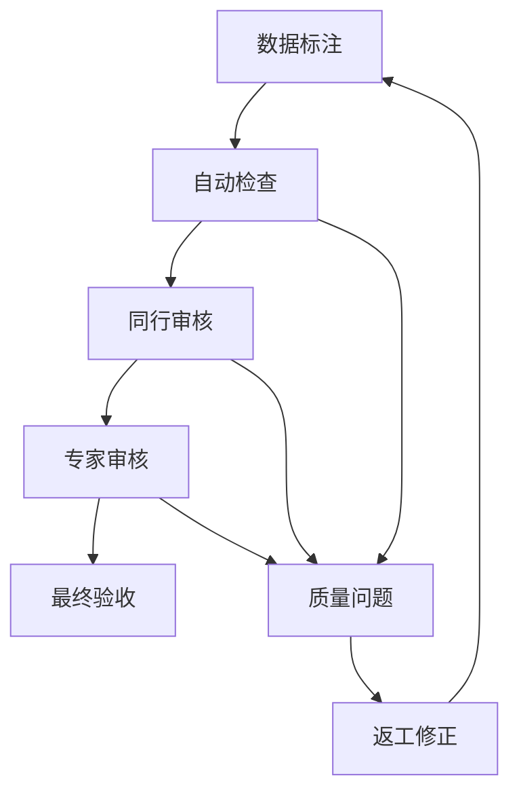
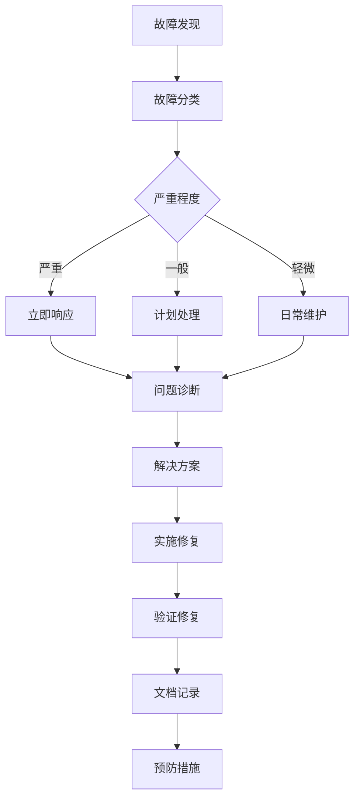
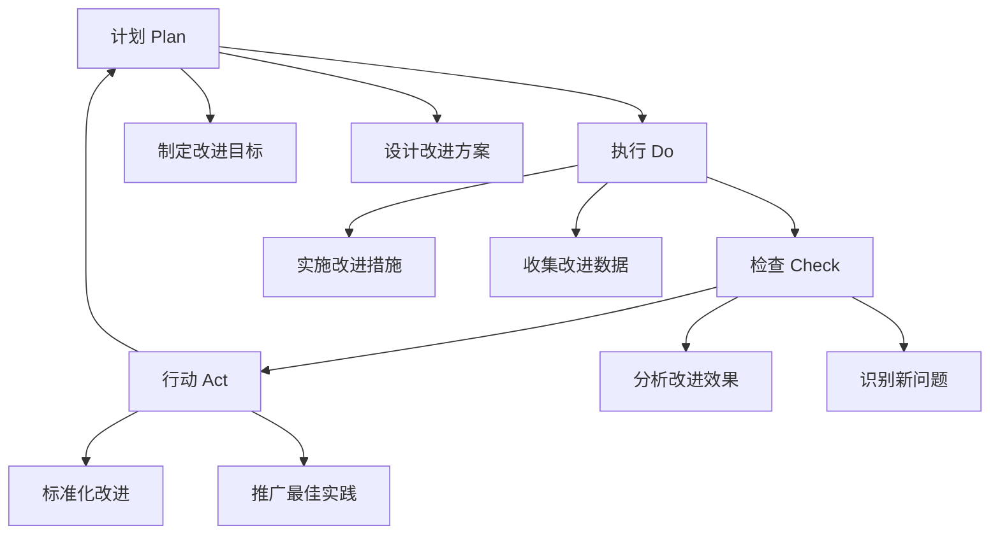

# Label Studio iframe 集成最佳实践

## 概述

本文档提供了使用 Label Studio iframe 集成的最佳实践建议，帮助用户和开发者充分利用系统功能，提高标注效率和质量。

## 项目规划最佳实践

### 1. 项目前期准备

#### 需求分析
```markdown
✅ 明确标注目标和用途
✅ 确定数据类型和规模
✅ 评估标注复杂度
✅ 制定质量标准
✅ 估算时间和资源需求
```

#### 团队组建
```markdown
✅ 配置项目管理员
✅ 选择经验丰富的标注员
✅ 指定质量审核员
✅ 建立沟通机制
✅ 制定培训计划
```

#### 数据准备
```markdown
✅ 数据清洗和预处理
✅ 数据格式标准化
✅ 数据质量检查
✅ 敏感信息脱敏
✅ 数据备份和版本控制
```

### 2. 标注规范制定

#### 标签体系设计

**层次化标签结构**:
```json
{
  "categories": {
    "person": {
      "subcategories": ["adult", "child", "elderly"],
      "attributes": ["gender", "clothing", "pose"]
    },
    "vehicle": {
      "subcategories": ["car", "truck", "motorcycle"],
      "attributes": ["color", "brand", "direction"]
    }
  }
}
```

**标签命名规范**:
```markdown
✅ 使用清晰、简洁的名称
✅ 避免歧义和重复
✅ 保持命名一致性
✅ 使用标准术语
✅ 支持多语言（如需要）
```

#### 标注指南编写

**详细的标注说明**:
```markdown
1. 标注目标定义
   - 明确什么需要标注
   - 什么不需要标注
   - 边界情况处理

2. 标注示例
   - 正确标注示例
   - 错误标注示例
   - 边界情况示例

3. 质量标准
   - 精度要求
   - 完整性要求
   - 一致性要求
```

## 标注质量最佳实践

### 1. 质量控制流程

#### 多层质量检查


#### 质量指标监控
```typescript
interface QualityMetrics {
  accuracy: number;        // 准确率 (>95%)
  consistency: number;     // 一致性 (>90%)
  completeness: number;    // 完整性 (>98%)
  efficiency: number;      // 效率 (标注速度)
  interAnnotatorAgreement: number; // 标注员间一致性 (>85%)
}

// 质量监控实现
const monitorQuality = (metrics: QualityMetrics) => {
  const alerts = [];
  
  if (metrics.accuracy < 0.95) {
    alerts.push('准确率低于标准');
  }
  
  if (metrics.consistency < 0.90) {
    alerts.push('一致性需要改进');
  }
  
  if (metrics.completeness < 0.98) {
    alerts.push('标注不够完整');
  }
  
  return alerts;
};
```

### 2. 标注一致性保证

#### 重复标注策略
```markdown
- 关键数据: 3人标注，专家仲裁
- 一般数据: 2人标注，交叉验证
- 简单数据: 1人标注，抽样检查
- 测试数据: 专家标注，作为标准
```

#### 标注员培训
```markdown
1. 基础培训 (2-3天)
   - 系统操作培训
   - 标注规范学习
   - 实践练习

2. 进阶培训 (1-2天)
   - 复杂场景处理
   - 质量标准深化
   - 效率提升技巧

3. 持续培训
   - 定期质量回顾
   - 新规范更新
   - 经验分享交流
```

### 3. 异常处理机制

#### 质量异常处理
```typescript
class QualityAnomalyHandler {
  handleLowAccuracy(annotatorId: string, accuracy: number) {
    if (accuracy < 0.8) {
      // 暂停标注，安排重新培训
      this.pauseAnnotator(annotatorId);
      this.scheduleRetraining(annotatorId);
    } else if (accuracy < 0.9) {
      // 增加审核频率
      this.increaseReviewFrequency(annotatorId);
    }
  }
  
  handleInconsistency(taskId: string, disagreementRate: number) {
    if (disagreementRate > 0.3) {
      // 专家仲裁
      this.escalateToExpert(taskId);
    } else if (disagreementRate > 0.2) {
      // 增加标注员数量
      this.addMoreAnnotators(taskId);
    }
  }
}
```

## 性能优化最佳实践

### 1. 系统性能优化

#### 前端优化
```typescript
// 1. 懒加载实现
const LazyIframeContainer = React.lazy(() => 
  import('./IframeContainer')
);

// 2. 内存管理
class MemoryManager {
  private cache = new Map();
  private maxCacheSize = 100;
  
  set(key: string, value: any) {
    if (this.cache.size >= this.maxCacheSize) {
      const firstKey = this.cache.keys().next().value;
      this.cache.delete(firstKey);
    }
    this.cache.set(key, value);
  }
  
  cleanup() {
    this.cache.clear();
  }
}

// 3. 资源预加载
const preloadNextTask = async (taskId: string) => {
  const link = document.createElement('link');
  link.rel = 'prefetch';
  link.href = `/api/tasks/${taskId}/data`;
  document.head.appendChild(link);
};
```

#### 后端优化
```python
# 1. 数据库查询优化
class TaskQueryOptimizer:
    def get_tasks_with_pagination(self, page: int, size: int):
        return db.query(Task)\
                 .options(selectinload(Task.annotations))\
                 .offset(page * size)\
                 .limit(size)\
                 .all()
    
    def get_tasks_with_cache(self, project_id: str):
        cache_key = f"tasks:{project_id}"
        cached = redis.get(cache_key)
        
        if cached:
            return json.loads(cached)
        
        tasks = self.get_tasks_by_project(project_id)
        redis.setex(cache_key, 300, json.dumps(tasks))
        return tasks

# 2. 异步处理
import asyncio
from concurrent.futures import ThreadPoolExecutor

class AsyncAnnotationProcessor:
    def __init__(self):
        self.executor = ThreadPoolExecutor(max_workers=10)
    
    async def process_annotation(self, annotation_data):
        loop = asyncio.get_event_loop()
        return await loop.run_in_executor(
            self.executor, 
            self._process_sync, 
            annotation_data
        )
```

### 2. 网络优化

#### 数据传输优化
```typescript
// 1. 数据压缩
import pako from 'pako';

class DataCompressor {
  compress(data: any): string {
    const jsonString = JSON.stringify(data);
    const compressed = pako.gzip(jsonString);
    return btoa(String.fromCharCode(...compressed));
  }
  
  decompress(compressedData: string): any {
    const compressed = new Uint8Array(
      atob(compressedData).split('').map(c => c.charCodeAt(0))
    );
    const decompressed = pako.ungzip(compressed, { to: 'string' });
    return JSON.parse(decompressed);
  }
}

// 2. 批量操作
class BatchOperationManager {
  private batchSize = 50;
  private batchTimeout = 1000;
  private pendingOperations: any[] = [];
  
  addOperation(operation: any) {
    this.pendingOperations.push(operation);
    
    if (this.pendingOperations.length >= this.batchSize) {
      this.processBatch();
    } else {
      setTimeout(() => this.processBatch(), this.batchTimeout);
    }
  }
  
  private async processBatch() {
    if (this.pendingOperations.length === 0) return;
    
    const batch = this.pendingOperations.splice(0, this.batchSize);
    await this.sendBatchRequest(batch);
  }
}
```

### 3. 用户体验优化

#### 界面响应优化
```typescript
// 1. 防抖处理
import { debounce } from 'lodash';

const debouncedSave = debounce(async (data) => {
  await saveAnnotation(data);
}, 1000);

// 2. 乐观更新
class OptimisticUpdater {
  async updateAnnotation(id: string, data: any) {
    // 立即更新 UI
    this.updateUI(id, data);
    
    try {
      // 发送到服务器
      await this.sendToServer(id, data);
    } catch (error) {
      // 回滚 UI 更新
      this.rollbackUI(id);
      throw error;
    }
  }
}

// 3. 加载状态管理
const useLoadingState = () => {
  const [loading, setLoading] = useState(false);
  const [error, setError] = useState<string | null>(null);
  
  const execute = async (operation: () => Promise<any>) => {
    setLoading(true);
    setError(null);
    
    try {
      const result = await operation();
      return result;
    } catch (err) {
      setError(err instanceof Error ? err.message : 'Unknown error');
      throw err;
    } finally {
      setLoading(false);
    }
  };
  
  return { loading, error, execute };
};
```

## 安全最佳实践

### 1. 数据安全

#### 敏感数据处理
```typescript
// 1. 数据脱敏
class DataMasker {
  maskPersonalInfo(text: string): string {
    return text
      .replace(/\d{11}/g, '***********') // 手机号
      .replace(/\d{15,18}/g, '******************') // 身份证
      .replace(/[\w.-]+@[\w.-]+\.\w+/g, '***@***.***'); // 邮箱
  }
  
  maskImageFaces(imageData: ImageData): ImageData {
    // 使用人脸检测算法模糊人脸区域
    const faces = this.detectFaces(imageData);
    return this.blurRegions(imageData, faces);
  }
}

// 2. 数据加密
import CryptoJS from 'crypto-js';

class DataEncryption {
  private secretKey = process.env.ENCRYPTION_KEY!;
  
  encrypt(data: any): string {
    const jsonString = JSON.stringify(data);
    return CryptoJS.AES.encrypt(jsonString, this.secretKey).toString();
  }
  
  decrypt(encryptedData: string): any {
    const bytes = CryptoJS.AES.decrypt(encryptedData, this.secretKey);
    const decryptedString = bytes.toString(CryptoJS.enc.Utf8);
    return JSON.parse(decryptedString);
  }
}
```

#### 访问控制
```typescript
// 1. 权限验证中间件
class PermissionMiddleware {
  checkPermission(requiredPermission: string) {
    return (req: Request, res: Response, next: NextFunction) => {
      const userPermissions = req.user?.permissions || [];
      
      if (!userPermissions.includes(requiredPermission)) {
        return res.status(403).json({ error: 'Permission denied' });
      }
      
      next();
    };
  }
}

// 2. 数据访问控制
class DataAccessController {
  async getAnnotationData(userId: string, taskId: string) {
    // 检查用户是否有访问该任务的权限
    const hasAccess = await this.checkTaskAccess(userId, taskId);
    
    if (!hasAccess) {
      throw new Error('Access denied');
    }
    
    return this.fetchTaskData(taskId);
  }
  
  private async checkTaskAccess(userId: string, taskId: string): Promise<boolean> {
    const task = await Task.findById(taskId);
    const project = await Project.findById(task.projectId);
    
    return project.members.includes(userId) || 
           project.ownerId === userId;
  }
}
```

### 2. 通信安全

#### 消息验证
```typescript
// 1. 消息签名
import crypto from 'crypto';

class MessageSigner {
  private secretKey = process.env.MESSAGE_SECRET!;
  
  sign(message: any): string {
    const messageString = JSON.stringify(message);
    return crypto
      .createHmac('sha256', this.secretKey)
      .update(messageString)
      .digest('hex');
  }
  
  verify(message: any, signature: string): boolean {
    const expectedSignature = this.sign(message);
    return crypto.timingSafeEqual(
      Buffer.from(signature, 'hex'),
      Buffer.from(expectedSignature, 'hex')
    );
  }
}

// 2. 来源验证
class OriginValidator {
  private allowedOrigins = [
    'http://localhost:3000',
    'https://app.superinsight.com'
  ];
  
  validateOrigin(origin: string): boolean {
    return this.allowedOrigins.includes(origin);
  }
  
  validateMessage(event: MessageEvent): boolean {
    if (!this.validateOrigin(event.origin)) {
      console.error('Invalid origin:', event.origin);
      return false;
    }
    
    if (!event.data || typeof event.data !== 'object') {
      console.error('Invalid message format');
      return false;
    }
    
    return true;
  }
}
```

## 监控和维护最佳实践

### 1. 系统监控

#### 性能监控
```typescript
// 1. 关键指标监控
class PerformanceMonitor {
  private metrics = {
    loadTime: 0,
    memoryUsage: 0,
    cpuUsage: 0,
    errorRate: 0,
    throughput: 0
  };
  
  startMonitoring() {
    // 监控加载时间
    this.monitorLoadTime();
    
    // 监控内存使用
    this.monitorMemoryUsage();
    
    // 监控错误率
    this.monitorErrorRate();
    
    // 监控吞吐量
    this.monitorThroughput();
  }
  
  private monitorLoadTime() {
    const observer = new PerformanceObserver((list) => {
      const entries = list.getEntries();
      entries.forEach((entry) => {
        if (entry.entryType === 'navigation') {
          this.metrics.loadTime = entry.loadEventEnd - entry.fetchStart;
        }
      });
    });
    
    observer.observe({ entryTypes: ['navigation'] });
  }
  
  getMetrics() {
    return { ...this.metrics };
  }
}

// 2. 告警系统
class AlertSystem {
  private thresholds = {
    loadTime: 5000,      // 5秒
    memoryUsage: 100,    // 100MB
    errorRate: 0.05,     // 5%
    responseTime: 2000   // 2秒
  };
  
  checkThresholds(metrics: any) {
    const alerts = [];
    
    if (metrics.loadTime > this.thresholds.loadTime) {
      alerts.push({
        type: 'performance',
        message: `Load time too high: ${metrics.loadTime}ms`,
        severity: 'warning'
      });
    }
    
    if (metrics.errorRate > this.thresholds.errorRate) {
      alerts.push({
        type: 'error',
        message: `Error rate too high: ${metrics.errorRate * 100}%`,
        severity: 'critical'
      });
    }
    
    return alerts;
  }
}
```

#### 业务监控
```typescript
// 1. 标注质量监控
class AnnotationQualityMonitor {
  async checkQualityTrends(projectId: string, timeRange: string) {
    const annotations = await this.getAnnotations(projectId, timeRange);
    
    const qualityMetrics = {
      averageAccuracy: this.calculateAverageAccuracy(annotations),
      consistencyScore: this.calculateConsistency(annotations),
      completionRate: this.calculateCompletionRate(annotations),
      reviewTime: this.calculateAverageReviewTime(annotations)
    };
    
    return qualityMetrics;
  }
  
  detectQualityAnomalies(metrics: any) {
    const anomalies = [];
    
    if (metrics.averageAccuracy < 0.9) {
      anomalies.push('Accuracy below threshold');
    }
    
    if (metrics.consistencyScore < 0.85) {
      anomalies.push('Consistency issues detected');
    }
    
    return anomalies;
  }
}

// 2. 用户行为监控
class UserBehaviorMonitor {
  trackAnnotationEvent(event: AnnotationEvent) {
    const eventData = {
      userId: event.userId,
      taskId: event.taskId,
      action: event.action,
      timestamp: Date.now(),
      duration: event.duration,
      quality: event.quality
    };
    
    // 发送到分析系统
    this.sendToAnalytics(eventData);
  }
  
  analyzeUserPerformance(userId: string) {
    return {
      annotationSpeed: this.calculateSpeed(userId),
      qualityScore: this.calculateQuality(userId),
      consistencyScore: this.calculateConsistency(userId),
      activityPattern: this.analyzeActivity(userId)
    };
  }
}
```

### 2. 维护策略

#### 定期维护任务
```markdown
## 日常维护 (每日)
- [ ] 检查系统运行状态
- [ ] 查看错误日志
- [ ] 监控性能指标
- [ ] 备份重要数据

## 周度维护 (每周)
- [ ] 清理临时文件
- [ ] 更新安全补丁
- [ ] 检查存储空间
- [ ] 分析用户反馈

## 月度维护 (每月)
- [ ] 系统性能优化
- [ ] 数据库维护
- [ ] 安全审计
- [ ] 容量规划

## 季度维护 (每季度)
- [ ] 系统升级
- [ ] 架构评估
- [ ] 灾难恢复测试
- [ ] 培训更新
```

#### 故障处理流程


## 团队协作最佳实践

### 1. 角色分工

#### 明确职责分工
```markdown
## 项目管理员
- 项目规划和资源分配
- 质量标准制定和监督
- 进度跟踪和风险管理
- 团队协调和沟通

## 标注员
- 按照规范执行标注任务
- 及时反馈问题和建议
- 参与质量改进活动
- 保持标注一致性

## 审核员
- 标注质量审核和反馈
- 标注规范完善和更新
- 疑难问题解决和指导
- 质量趋势分析和报告

## 技术支持
- 系统维护和故障处理
- 功能开发和优化
- 技术培训和支持
- 数据安全和备份
```

### 2. 沟通协作

#### 建立有效沟通机制
```markdown
## 日常沟通
- 每日站会: 进度同步和问题反馈
- 即时通讯: 紧急问题快速响应
- 工作日志: 记录工作内容和问题

## 定期会议
- 周会: 项目进度和质量回顾
- 月会: 阶段总结和计划调整
- 季度会: 项目评估和改进规划

## 知识分享
- 经验分享会: 最佳实践交流
- 技术培训: 新功能和工具培训
- 文档维护: 知识库更新和完善
```

## 持续改进建议

### 1. 质量改进循环



### 2. 创新实践

#### 技术创新
```markdown
- 探索 AI 辅助标注技术
- 研究自动化质量检查方法
- 开发智能标注推荐系统
- 集成先进的数据处理工具
```

#### 流程创新
```markdown
- 优化标注工作流程
- 改进质量控制机制
- 创新协作模式
- 提升用户体验
```

---

**版本**: v1.0  
**更新日期**: 2026年1月5日  
**适用场景**: 企业级数据标注项目