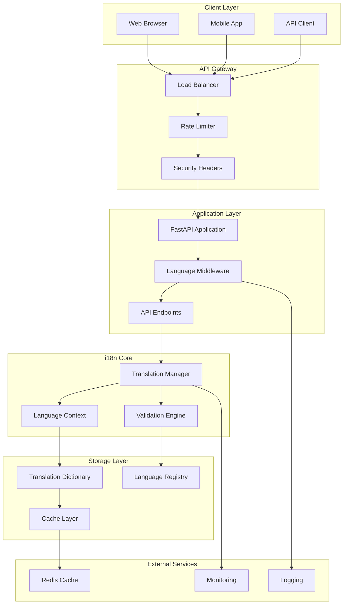
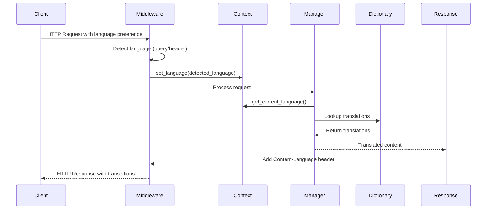
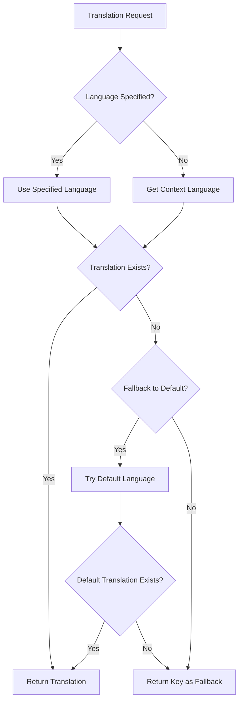

# SuperInsight i18n Architecture Documentation

## Overview

The SuperInsight internationalization (i18n) system is designed as a modular, high-performance, and thread-safe solution for multi-language support. This document provides detailed architectural insights for developers working with or extending the system.

## Architectural Principles

### 1. Separation of Concerns
- **Translation Storage**: Centralized dictionary management
- **Language Management**: Context-aware language state handling
- **API Integration**: RESTful endpoints for external access
- **Middleware Processing**: Automatic request/response handling

### 2. Performance First
- O(1) translation lookup using dictionary-based storage
- Context variables for thread-safe per-request state
- Lazy loading and caching strategies
- Minimal memory footprint

### 3. Extensibility
- Plugin architecture for new languages
- Configurable translation sources
- Modular component design
- Clear interfaces for customization

### 4. Reliability
- Graceful fallback mechanisms
- Comprehensive error handling
- Thread-safe concurrent access
- Robust validation and sanitization

## System Architecture



## Core Components

### Translation Manager (`src/i18n/manager.py`)

The Translation Manager is the central orchestrator for all i18n operations.

**Key Responsibilities:**
- Language state management
- Translation query processing
- Batch operations
- Error handling and fallbacks

**Design Patterns:**
- **Singleton Pattern**: Global manager instance
- **Strategy Pattern**: Pluggable translation sources
- **Observer Pattern**: Language change notifications

```python
class TranslationManager:
    """
    Central manager for i18n operations.
    
    Design Decisions:
    - Uses context variables for thread safety
    - Implements lazy loading for performance
    - Provides both sync and async interfaces
    """
    
    def __init__(self, default_language: str = 'zh'):
        self._default_language = default_language
        self._translations = {}  # Lazy-loaded translations
        self._supported_languages = ['zh', 'en']
        self._validators = []  # Pluggable validators
    
    def translate(self, key: str, language: Optional[str] = None, **kwargs) -> str:
        """
        Core translation method with fallback logic.
        
        Fallback Chain:
        1. Requested language translation
        2. Current context language
        3. Default language (Chinese)
        4. Translation key itself
        """
```

**Performance Considerations:**
- Dictionary-based O(1) lookup
- Lazy loading of translation data
- Context variable caching
- Minimal object creation

### Language Context (`src/i18n/context.py`)

Manages per-request language state using Python's contextvars.

**Design Rationale:**
- **Thread Safety**: Each request gets isolated language context
- **Performance**: No locking mechanisms needed
- **Simplicity**: Automatic context propagation

```python
from contextvars import ContextVar
from typing import Optional

# Global context variable for current language
_current_language: ContextVar[str] = ContextVar('language', default='zh')

def set_language(language: str) -> None:
    """Set language for current context."""
    _current_language.set(language)

def get_current_language() -> str:
    """Get language from current context."""
    return _current_language.get()
```

**Context Lifecycle:**
1. Request arrives → Middleware detects language
2. Context variable set → Available to all request handlers
3. Request completes → Context automatically cleaned up

### Translation Dictionary (`src/i18n/translations.py`)

Centralized storage for all translation key-value pairs.

**Storage Strategy:**
- Nested dictionary structure for O(1) access
- Immutable data for thread safety
- Comprehensive key coverage (90+ keys)

```python
TRANSLATIONS: Dict[str, Dict[str, str]] = {
    'zh': {
        'app_name': 'SuperInsight 平台',
        'login': '登录',
        # ... 90+ keys
    },
    'en': {
        'app_name': 'SuperInsight Platform', 
        'login': 'Login',
        # ... 90+ keys
    }
}
```

**Key Design Decisions:**
- **Static Dictionary**: Fast startup, predictable memory usage
- **Hierarchical Keys**: Organized by functional areas
- **Parameter Support**: String formatting for dynamic content
- **Validation**: Completeness checking across languages

### Language Middleware (`src/i18n/middleware.py`)

FastAPI middleware for automatic language processing.

**Processing Pipeline:**
1. **Detection**: Extract language from query params/headers
2. **Validation**: Verify language code against supported list
3. **Context Setting**: Set language in request context
4. **Response Headers**: Add Content-Language header

```python
@app.middleware("http")
async def language_middleware(request: Request, call_next: Callable) -> Response:
    """
    Language detection and context setting middleware.
    
    Priority Order:
    1. Query parameter (?language=en)
    2. Accept-Language header
    3. Default language (zh)
    """
    
    # Detection logic
    language = detect_language_from_request(request)
    
    # Set context
    set_language(language)
    
    # Process request
    response = await call_next(request)
    
    # Add response headers
    response.headers["Content-Language"] = language
    
    return response
```

**Error Handling Strategy:**
- **Graceful Degradation**: Invalid languages fallback to default
- **Silent Failures**: Don't break request processing
- **Comprehensive Logging**: Track issues for debugging

## Data Flow Architecture

### Request Processing Flow



### Translation Lookup Flow



## Performance Architecture

### Caching Strategy

**Multi-Level Caching:**
1. **Application Level**: In-memory dictionary storage
2. **Context Level**: Per-request language caching
3. **External Level**: Redis for distributed caching (optional)

```python
class CacheManager:
    """
    Multi-level caching for translation performance.
    """
    
    def __init__(self):
        self.memory_cache = {}  # L1 cache
        self.redis_client = None  # L2 cache (optional)
    
    def get_translation(self, key: str, language: str) -> Optional[str]:
        # L1 cache check
        cache_key = f"{language}:{key}"
        if cache_key in self.memory_cache:
            return self.memory_cache[cache_key]
        
        # L2 cache check (if enabled)
        if self.redis_client:
            cached = self.redis_client.get(cache_key)
            if cached:
                self.memory_cache[cache_key] = cached  # Populate L1
                return cached
        
        return None
```

### Memory Management

**Optimization Strategies:**
- **Lazy Loading**: Load translations only when needed
- **Immutable Data**: Prevent accidental modifications
- **Minimal Objects**: Reduce garbage collection pressure
- **Context Cleanup**: Automatic context variable cleanup

### Concurrency Model

**Thread Safety Approach:**
- **Context Variables**: Isolated per-request state
- **Immutable Data**: No shared mutable state
- **Lock-Free Design**: No synchronization primitives needed

```python
# Thread-safe by design - no locks needed
def get_translation(key: str) -> str:
    language = get_current_language()  # Context variable
    return TRANSLATIONS[language].get(key, key)  # Immutable dictionary
```

## Error Handling Architecture

### Error Categories

1. **Translation Errors**
   - Missing translation keys
   - Invalid language codes
   - Malformed translation requests

2. **System Errors**
   - Context variable failures
   - Memory allocation issues
   - External service failures

3. **API Errors**
   - Invalid request parameters
   - Authentication failures
   - Rate limiting violations

### Fallback Mechanisms

```python
class FallbackChain:
    """
    Implements cascading fallback for translation failures.
    """
    
    def get_translation(self, key: str, language: str) -> str:
        # Primary: Requested language
        if translation := self._get_from_language(key, language):
            return translation
        
        # Secondary: Default language
        if translation := self._get_from_language(key, self.default_language):
            self._log_fallback(key, language, self.default_language)
            return translation
        
        # Tertiary: Return key itself
        self._log_missing_key(key)
        return key
```

### Error Recovery

**Recovery Strategies:**
- **Graceful Degradation**: System continues with fallbacks
- **Circuit Breaker**: Prevent cascade failures
- **Retry Logic**: Automatic retry for transient failures
- **Health Monitoring**: Proactive issue detection

## Extension Architecture

### Adding New Languages

**Extension Points:**
1. **Translation Dictionary**: Add new language entries
2. **Language Registry**: Register language metadata
3. **Validation Rules**: Add language-specific validation
4. **Formatting Rules**: Add locale-specific formatting

```python
# Extension example: Adding Japanese support
def register_japanese_language():
    # 1. Add translations
    TRANSLATIONS['ja'] = {
        'app_name': 'SuperInsight プラットフォーム',
        'login': 'ログイン',
        # ... more translations
    }
    
    # 2. Register language
    SUPPORTED_LANGUAGES.append('ja')
    
    # 3. Add validation rules
    LANGUAGE_VALIDATORS['ja'] = JapaneseValidator()
    
    # 4. Add formatting rules
    FORMATTERS['ja'] = JapaneseFormatter()
```

### Custom Translation Sources

**Plugin Interface:**
```python
class TranslationSource(ABC):
    """Abstract base class for translation sources."""
    
    @abstractmethod
    def get_translation(self, key: str, language: str) -> Optional[str]:
        """Get translation from this source."""
        pass
    
    @abstractmethod
    def get_all_translations(self, language: str) -> Dict[str, str]:
        """Get all translations for a language."""
        pass

class DatabaseTranslationSource(TranslationSource):
    """Example: Database-backed translation source."""
    
    def get_translation(self, key: str, language: str) -> Optional[str]:
        # Query database for translation
        return self.db.query_translation(key, language)
```

### Middleware Extensions

**Custom Middleware:**
```python
class CustomLanguageMiddleware(BaseHTTPMiddleware):
    """
    Example: Custom language detection middleware.
    """
    
    async def dispatch(self, request: Request, call_next):
        # Custom language detection logic
        language = self.detect_custom_language(request)
        
        # Set context
        set_language(language)
        
        # Continue processing
        response = await call_next(request)
        
        # Custom response processing
        self.add_custom_headers(response, language)
        
        return response
```

## Testing Architecture

### Test Strategy

**Multi-Level Testing:**
1. **Unit Tests**: Individual component testing
2. **Integration Tests**: Component interaction testing
3. **Property Tests**: Universal behavior validation
4. **Performance Tests**: Load and stress testing

### Property-Based Testing

**Property Categories:**
- **Correctness Properties**: Translation accuracy and completeness
- **Performance Properties**: Response time and throughput
- **Safety Properties**: Error handling and recovery
- **Liveness Properties**: System availability and responsiveness

```python
# Example property test
@given(st.text(), st.sampled_from(['zh', 'en']))
def test_translation_roundtrip_property(key, language):
    """Property: Translation lookup should be consistent."""
    manager = get_manager()
    
    # Get translation twice
    translation1 = manager.translate(key, language)
    translation2 = manager.translate(key, language)
    
    # Should be identical
    assert translation1 == translation2
```

### Test Data Management

**Test Fixtures:**
- **Translation Fixtures**: Predefined translation sets
- **Language Fixtures**: Test language configurations
- **Request Fixtures**: HTTP request scenarios
- **Error Fixtures**: Error condition simulations

## Monitoring and Observability

### Metrics Collection

**Key Metrics:**
- Translation lookup performance
- Cache hit/miss ratios
- Error rates by category
- Language usage statistics
- API endpoint performance

```python
class I18nMetrics:
    """Metrics collection for i18n system."""
    
    def __init__(self):
        self.translation_counter = Counter()
        self.error_counter = Counter()
        self.performance_histogram = Histogram()
    
    def record_translation(self, key: str, language: str, duration: float):
        self.translation_counter.labels(key=key, language=language).inc()
        self.performance_histogram.observe(duration)
    
    def record_error(self, error_type: str, language: str):
        self.error_counter.labels(type=error_type, language=language).inc()
```

### Health Monitoring

**Health Checks:**
- Translation dictionary integrity
- Context variable functionality
- API endpoint availability
- External service connectivity

### Logging Strategy

**Log Categories:**
- **Access Logs**: Request/response tracking
- **Error Logs**: Error conditions and recovery
- **Performance Logs**: Timing and resource usage
- **Debug Logs**: Detailed execution tracing

## Security Architecture

### Input Validation

**Validation Layers:**
1. **API Level**: Request parameter validation
2. **Manager Level**: Translation key validation
3. **Storage Level**: Data integrity validation

### Security Measures

**Protection Mechanisms:**
- **Input Sanitization**: Prevent injection attacks
- **Rate Limiting**: Prevent abuse
- **Authentication**: Secure API access
- **Audit Logging**: Security event tracking

```python
class SecurityValidator:
    """Security validation for i18n inputs."""
    
    def validate_language_code(self, language: str) -> str:
        if not re.match(r'^[a-z]{2}$', language):
            raise ValidationError("Invalid language code format")
        
        if language not in SUPPORTED_LANGUAGES:
            raise ValidationError("Unsupported language")
        
        return language
    
    def validate_translation_key(self, key: str) -> str:
        if len(key) > MAX_KEY_LENGTH:
            raise ValidationError("Translation key too long")
        
        if not re.match(r'^[a-zA-Z0-9_.-]+$', key):
            raise ValidationError("Invalid key format")
        
        return key
```

## Deployment Architecture

### Containerization

**Docker Strategy:**
- **Multi-stage builds**: Optimize image size
- **Health checks**: Container health monitoring
- **Configuration**: Environment-based configuration
- **Logging**: Structured log output

### Kubernetes Deployment

**K8s Resources:**
- **Deployments**: Application instances
- **Services**: Load balancing
- **ConfigMaps**: Configuration management
- **Secrets**: Sensitive data management

### Scaling Considerations

**Horizontal Scaling:**
- Stateless design enables easy scaling
- Context variables provide request isolation
- Shared cache for consistency across instances

**Vertical Scaling:**
- Memory usage optimization
- CPU-efficient algorithms
- Minimal resource footprint

This architecture documentation provides the foundation for understanding, extending, and maintaining the SuperInsight i18n system.