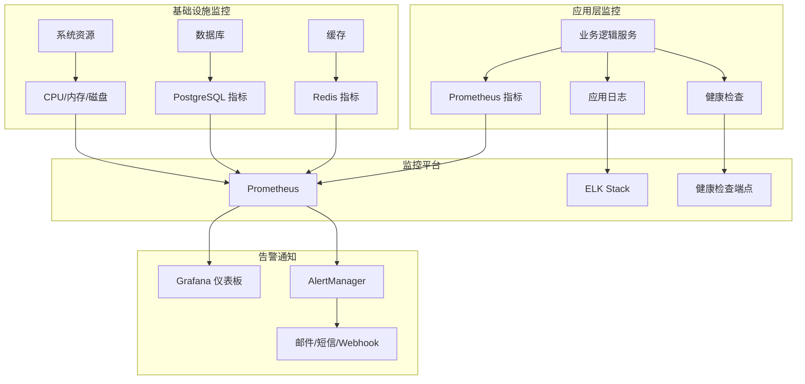

# 业务逻辑功能监控与维护指南

## 概述

本指南详细介绍如何监控和维护 SuperInsight 业务逻辑提炼与智能化功能，确保系统稳定运行和最佳性能。

## 监控体系

### 1. 监控架构



### 2. 核心监控指标

#### 业务指标

```python
# monitoring/business_metrics.py
from prometheus_client import Counter, Histogram, Gauge, Summary
import time
from functools import wraps

# 业务逻辑分析请求
bl_analysis_requests_total = Counter(
    'bl_analysis_requests_total',
    'Total business logic analysis requests',
    ['algorithm', 'status', 'user_role', 'project_id']
)

# 分析执行时间
bl_analysis_duration_seconds = Histogram(
    'bl_analysis_duration_seconds',
    'Business logic analysis duration in seconds',
    ['algorithm', 'data_size_range'],
    buckets=[0.1, 0.5, 1.0, 5.0, 10.0, 30.0, 60.0, 300.0, 600.0]
)

# 活跃分析数量
bl_active_analyses = Gauge(
    'bl_active_analyses',
    'Number of currently active business logic analyses'
)

# 规则提取数量
bl_rules_extracted_total = Counter(
    'bl_rules_extracted_total',
    'Total number of business rules extracted',
    ['algorithm', 'project_id']
)

# 模式识别准确率
bl_pattern_accuracy = Gauge(
    'bl_pattern_accuracy',
    'Business logic pattern recognition accuracy',
    ['algorithm']
)

# 缓存命中率
bl_cache_hit_rate = Gauge(
    'bl_cache_hit_rate',
    'Business logic cache hit rate'
)

# 数据处理量
bl_data_processed_total = Counter(
    'bl_data_processed_total',
    'Total amount of data processed',
    ['algorithm', 'data_type']
)

class BusinessLogicMetrics:
    """业务逻辑指标收集器"""
    
    @staticmethod
    def track_analysis_request(algorithm: str, status: str, user_role: str, project_id: str):
        """跟踪分析请求"""
        bl_analysis_requests_total.labels(
            algorithm=algorithm,
            status=status,
            user_role=user_role,
            project_id=project_id
        ).inc()
    
    @staticmethod
    def track_analysis_duration(algorithm: str, data_size: int, duration: float):
        """跟踪分析执行时间"""
        data_size_range = BusinessLogicMetrics._get_data_size_range(data_size)
        bl_analysis_duration_seconds.labels(
            algorithm=algorithm,
            data_size_range=data_size_range
        ).observe(duration)
    
    @staticmethod
    def track_rules_extracted(algorithm: str, project_id: str, count: int):
        """跟踪规则提取数量"""
        bl_rules_extracted_total.labels(
            algorithm=algorithm,
            project_id=project_id
        ).inc(count)
    
    @staticmethod
    def update_pattern_accuracy(algorithm: str, accuracy: float):
        """更新模式识别准确率"""
        bl_pattern_accuracy.labels(algorithm=algorithm).set(accuracy)
    
    @staticmethod
    def update_cache_hit_rate(hit_rate: float):
        """更新缓存命中率"""
        bl_cache_hit_rate.set(hit_rate)
    
    @staticmethod
    def track_data_processed(algorithm: str, data_type: str, count: int):
        """跟踪数据处理量"""
        bl_data_processed_total.labels(
            algorithm=algorithm,
            data_type=data_type
        ).inc(count)
    
    @staticmethod
    def _get_data_size_range(size: int) -> str:
        """获取数据大小范围"""
        if size < 100:
            return 'tiny'
        elif size < 1000:
            return 'small'
        elif size < 10000:
            return 'medium'
        elif size < 100000:
            return 'large'
        else:
            return 'xlarge'

def monitor_analysis(algorithm: str):
    """分析监控装饰器"""
    def decorator(func):
        @wraps(func)
        async def wrapper(*args, **kwargs):
            start_time = time.time()
            bl_active_analyses.inc()
            
            try:
                result = await func(*args, **kwargs)
                status = 'success'
                return result
            except Exception as e:
                status = 'error'
                raise
            finally:
                duration = time.time() - start_time
                bl_active_analyses.dec()
                
                # 从参数中提取信息
                data_size = len(kwargs.get('data', []))
                user_role = kwargs.get('user_role', 'unknown')
                project_id = kwargs.get('project_id', 'unknown')
                
                BusinessLogicMetrics.track_analysis_request(
                    algorithm, status, user_role, project_id
                )
                BusinessLogicMetrics.track_analysis_duration(
                    algorithm, data_size, duration
                )
        
        return wrapper
    return decorator
```

#### 系统指标

```python
# monitoring/system_metrics.py
import psutil
import time
from prometheus_client import Gauge
import asyncio

# 系统资源指标
bl_cpu_usage_percent = Gauge('bl_cpu_usage_percent', 'CPU usage percentage')
bl_memory_usage_bytes = Gauge('bl_memory_usage_bytes', 'Memory usage in bytes')
bl_memory_usage_percent = Gauge('bl_memory_usage_percent', 'Memory usage percentage')
bl_disk_usage_percent = Gauge('bl_disk_usage_percent', 'Disk usage percentage')
bl_disk_io_read_bytes = Gauge('bl_disk_io_read_bytes', 'Disk I/O read bytes')
bl_disk_io_write_bytes = Gauge('bl_disk_io_write_bytes', 'Disk I/O write bytes')

# 数据库指标
bl_db_connections_active = Gauge('bl_db_connections_active', 'Active database connections')
bl_db_connections_idle = Gauge('bl_db_connections_idle', 'Idle database connections')
bl_db_query_duration_seconds = Gauge('bl_db_query_duration_seconds', 'Database query duration')

# Redis 指标
bl_redis_connected_clients = Gauge('bl_redis_connected_clients', 'Redis connected clients')
bl_redis_memory_usage_bytes = Gauge('bl_redis_memory_usage_bytes', 'Redis memory usage')
bl_redis_keyspace_hits = Gauge('bl_redis_keyspace_hits', 'Redis keyspace hits')
bl_redis_keyspace_misses = Gauge('bl_redis_keyspace_misses', 'Redis keyspace misses')

class SystemMetricsCollector:
    """系统指标收集器"""
    
    def __init__(self, collection_interval: int = 30):
        self.collection_interval = collection_interval
        self.running = False
    
    async def start_collection(self):
        """开始收集指标"""
        self.running = True
        while self.running:
            try:
                await self._collect_system_metrics()
                await self._collect_database_metrics()
                await self._collect_redis_metrics()
                await asyncio.sleep(self.collection_interval)
            except Exception as e:
                print(f"指标收集错误: {e}")
                await asyncio.sleep(self.collection_interval)
    
    def stop_collection(self):
        """停止收集指标"""
        self.running = False
    
    async def _collect_system_metrics(self):
        """收集系统指标"""
        # CPU 使用率
        cpu_percent = psutil.cpu_percent(interval=1)
        bl_cpu_usage_percent.set(cpu_percent)
        
        # 内存使用
        memory = psutil.virtual_memory()
        bl_memory_usage_bytes.set(memory.used)
        bl_memory_usage_percent.set(memory.percent)
        
        # 磁盘使用
        disk = psutil.disk_usage('/')
        bl_disk_usage_percent.set(disk.percent)
        
        # 磁盘 I/O
        disk_io = psutil.disk_io_counters()
        if disk_io:
            bl_disk_io_read_bytes.set(disk_io.read_bytes)
            bl_disk_io_write_bytes.set(disk_io.write_bytes)
    
    async def _collect_database_metrics(self):
        """收集数据库指标"""
        try:
            from src.database import get_db_session
            
            async with get_db_session() as session:
                # 活跃连接数
                result = await session.execute(
                    "SELECT count(*) FROM pg_stat_activity WHERE state = 'active'"
                )
                active_connections = result.scalar()
                bl_db_connections_active.set(active_connections)
                
                # 空闲连接数
                result = await session.execute(
                    "SELECT count(*) FROM pg_stat_activity WHERE state = 'idle'"
                )
                idle_connections = result.scalar()
                bl_db_connections_idle.set(idle_connections)
                
        except Exception as e:
            print(f"数据库指标收集失败: {e}")
    
    async def _collect_redis_metrics(self):
        """收集 Redis 指标"""
        try:
            import redis
            from config.business_logic_config import settings
            
            redis_client = redis.from_url(settings.redis_url)
            info = redis_client.info()
            
            # 连接客户端数
            bl_redis_connected_clients.set(info.get('connected_clients', 0))
            
            # 内存使用
            bl_redis_memory_usage_bytes.set(info.get('used_memory', 0))
            
            # 缓存命中率
            keyspace_hits = info.get('keyspace_hits', 0)
            keyspace_misses = info.get('keyspace_misses', 0)
            
            bl_redis_keyspace_hits.set(keyspace_hits)
            bl_redis_keyspace_misses.set(keyspace_misses)
            
        except Exception as e:
            print(f"Redis 指标收集失败: {e}")
```

### 3. 告警规则配置

```yaml
# config/alert_rules.yaml
groups:
  - name: business_logic_alerts
    rules:
      # 高延迟告警
      - alert: BusinessLogicHighLatency
        expr: histogram_quantile(0.95, bl_analysis_duration_seconds) > 60
        for: 5m
        labels:
          severity: warning
          service: business_logic
        annotations:
          summary: "业务逻辑分析延迟过高"
          description: "95% 的业务逻辑分析请求超过 60 秒"
      
      # 高错误率告警
      - alert: BusinessLogicHighErrorRate
        expr: rate(bl_analysis_requests_total{status="error"}[5m]) / rate(bl_analysis_requests_total[5m]) > 0.1
        for: 2m
        labels:
          severity: critical
          service: business_logic
        annotations:
          summary: "业务逻辑错误率过高"
          description: "业务逻辑分析错误率超过 10%"
      
      # 内存使用过高告警
      - alert: BusinessLogicHighMemoryUsage
        expr: bl_memory_usage_percent > 85
        for: 5m
        labels:
          severity: warning
          service: business_logic
        annotations:
          summary: "业务逻辑内存使用过高"
          description: "内存使用率超过 85%: {{ $value }}%"
      
      # CPU 使用过高告警
      - alert: BusinessLogicHighCPUUsage
        expr: bl_cpu_usage_percent > 80
        for: 5m
        labels:
          severity: warning
          service: business_logic
        annotations:
          summary: "业务逻辑 CPU 使用过高"
          description: "CPU 使用率超过 80%: {{ $value }}%"
      
      # 数据库连接过多告警
      - alert: BusinessLogicTooManyDBConnections
        expr: bl_db_connections_active > 50
        for: 2m
        labels:
          severity: warning
          service: business_logic
        annotations:
          summary: "数据库连接数过多"
          description: "活跃数据库连接数超过 50: {{ $value }}"
      
      # 缓存命中率过低告警
      - alert: BusinessLogicLowCacheHitRate
        expr: bl_cache_hit_rate < 0.7
        for: 10m
        labels:
          severity: warning
          service: business_logic
        annotations:
          summary: "缓存命中率过低"
          description: "缓存命中率低于 70%: {{ $value }}"
      
      # 服务不可用告警
      - alert: BusinessLogicServiceDown
        expr: up{job="business_logic"} == 0
        for: 1m
        labels:
          severity: critical
          service: business_logic
        annotations:
          summary: "业务逻辑服务不可用"
          description: "业务逻辑服务已停止响应"
```

## 日志管理

### 1. 日志配置

```python
# logging/business_logic_logger.py
import logging
import json
import sys
from datetime import datetime
from typing import Dict, Any
from pathlib import Path

class BusinessLogicLogger:
    """业务逻辑日志管理器"""
    
    def __init__(self, config: Dict[str, Any]):
        self.config = config
        self.logger = logging.getLogger('business_logic')
        self._setup_logger()
    
    def _setup_logger(self):
        """设置日志器"""
        # 设置日志级别
        log_level = self.config.get('level', 'INFO')
        self.logger.setLevel(getattr(logging, log_level))
        
        # 清除现有处理器
        self.logger.handlers.clear()
        
        # 控制台处理器
        console_handler = logging.StreamHandler(sys.stdout)
        console_handler.setLevel(logging.INFO)
        
        # 文件处理器
        log_file = self.config.get('file', '/var/log/superinsight/business_logic.log')
        Path(log_file).parent.mkdir(parents=True, exist_ok=True)
        
        file_handler = logging.handlers.RotatingFileHandler(
            log_file,
            maxBytes=self.config.get('max_size', 100 * 1024 * 1024),  # 100MB
            backupCount=self.config.get('backup_count', 10)
        )
        file_handler.setLevel(logging.DEBUG)
        
        # 设置格式器
        if self.config.get('format') == 'json':
            formatter = JsonFormatter()
        else:
            formatter = logging.Formatter(
                '%(asctime)s - %(name)s - %(levelname)s - %(message)s'
            )
        
        console_handler.setFormatter(formatter)
        file_handler.setFormatter(formatter)
        
        # 添加处理器
        self.logger.addHandler(console_handler)
        self.logger.addHandler(file_handler)
    
    def log_analysis_start(self, algorithm: str, project_id: str, user_id: str, data_size: int):
        """记录分析开始"""
        self.logger.info(json.dumps({
            'event': 'analysis_start',
            'algorithm': algorithm,
            'project_id': project_id,
            'user_id': user_id,
            'data_size': data_size,
            'timestamp': datetime.utcnow().isoformat()
        }))
    
    def log_analysis_complete(self, algorithm: str, project_id: str, duration: float, 
                            patterns_found: int, rules_extracted: int):
        """记录分析完成"""
        self.logger.info(json.dumps({
            'event': 'analysis_complete',
            'algorithm': algorithm,
            'project_id': project_id,
            'duration': duration,
            'patterns_found': patterns_found,
            'rules_extracted': rules_extracted,
            'timestamp': datetime.utcnow().isoformat()
        }))
    
    def log_analysis_error(self, algorithm: str, project_id: str, error: str, duration: float):
        """记录分析错误"""
        self.logger.error(json.dumps({
            'event': 'analysis_error',
            'algorithm': algorithm,
            'project_id': project_id,
            'error': error,
            'duration': duration,
            'timestamp': datetime.utcnow().isoformat()
        }))
    
    def log_cache_operation(self, operation: str, key: str, hit: bool = None):
        """记录缓存操作"""
        log_data = {
            'event': 'cache_operation',
            'operation': operation,
            'key': key,
            'timestamp': datetime.utcnow().isoformat()
        }
        
        if hit is not None:
            log_data['hit'] = hit
        
        self.logger.debug(json.dumps(log_data))
    
    def log_user_action(self, user_id: str, action: str, resource: str, details: Dict[str, Any] = None):
        """记录用户操作"""
        log_data = {
            'event': 'user_action',
            'user_id': user_id,
            'action': action,
            'resource': resource,
            'timestamp': datetime.utcnow().isoformat()
        }
        
        if details:
            log_data['details'] = details
        
        self.logger.info(json.dumps(log_data))

class JsonFormatter(logging.Formatter):
    """JSON 格式化器"""
    
    def format(self, record):
        log_data = {
            'timestamp': datetime.utcnow().isoformat(),
            'level': record.levelname,
            'logger': record.name,
            'message': record.getMessage(),
            'module': record.module,
            'function': record.funcName,
            'line': record.lineno
        }
        
        # 添加异常信息
        if record.exc_info:
            log_data['exception'] = self.formatException(record.exc_info)
        
        return json.dumps(log_data)
```

### 2. 日志分析工具

```python
# tools/log_analyzer.py
import json
import re
from datetime import datetime, timedelta
from typing import Dict, Any, List
from collections import defaultdict, Counter
import pandas as pd

class BusinessLogicLogAnalyzer:
    """业务逻辑日志分析器"""
    
    def __init__(self, log_file: str):
        self.log_file = log_file
    
    def analyze_performance(self, hours: int = 24) -> Dict[str, Any]:
        """分析性能指标"""
        end_time = datetime.utcnow()
        start_time = end_time - timedelta(hours=hours)
        
        analysis_events = self._extract_analysis_events(start_time, end_time)
        
        # 计算性能指标
        durations = [event['duration'] for event in analysis_events if 'duration' in event]
        
        if not durations:
            return {'error': '没有找到分析事件'}
        
        return {
            'total_analyses': len(analysis_events),
            'avg_duration': sum(durations) / len(durations),
            'min_duration': min(durations),
            'max_duration': max(durations),
            'success_rate': len([e for e in analysis_events if e.get('event') == 'analysis_complete']) / len(analysis_events),
            'algorithm_performance': self._analyze_algorithm_performance(analysis_events)
        }
    
    def analyze_errors(self, hours: int = 24) -> Dict[str, Any]:
        """分析错误情况"""
        end_time = datetime.utcnow()
        start_time = end_time - timedelta(hours=hours)
        
        error_events = self._extract_error_events(start_time, end_time)
        
        # 错误分类
        error_types = Counter()
        error_algorithms = Counter()
        
        for event in error_events:
            error_types[event.get('error', 'unknown')] += 1
            error_algorithms[event.get('algorithm', 'unknown')] += 1
        
        return {
            'total_errors': len(error_events),
            'error_types': dict(error_types.most_common(10)),
            'error_by_algorithm': dict(error_algorithms.most_common()),
            'error_timeline': self._create_error_timeline(error_events)
        }
    
    def analyze_user_activity(self, hours: int = 24) -> Dict[str, Any]:
        """分析用户活动"""
        end_time = datetime.utcnow()
        start_time = end_time - timedelta(hours=hours)
        
        user_events = self._extract_user_events(start_time, end_time)
        
        # 用户活动统计
        user_actions = Counter()
        active_users = set()
        
        for event in user_events:
            user_id = event.get('user_id')
            action = event.get('action')
            
            if user_id:
                active_users.add(user_id)
                user_actions[action] += 1
        
        return {
            'active_users': len(active_users),
            'total_actions': len(user_events),
            'action_distribution': dict(user_actions.most_common()),
            'user_activity_timeline': self._create_user_activity_timeline(user_events)
        }
    
    def _extract_analysis_events(self, start_time: datetime, end_time: datetime) -> List[Dict[str, Any]]:
        """提取分析事件"""
        events = []
        
        try:
            with open(self.log_file, 'r') as f:
                for line in f:
                    try:
                        log_entry = json.loads(line.strip())
                        
                        # 检查时间范围
                        timestamp = datetime.fromisoformat(log_entry.get('timestamp', ''))
                        if not (start_time <= timestamp <= end_time):
                            continue
                        
                        # 检查事件类型
                        if log_entry.get('event') in ['analysis_start', 'analysis_complete', 'analysis_error']:
                            events.append(log_entry)
                            
                    except (json.JSONDecodeError, ValueError):
                        continue
                        
        except FileNotFoundError:
            pass
        
        return events
    
    def _extract_error_events(self, start_time: datetime, end_time: datetime) -> List[Dict[str, Any]]:
        """提取错误事件"""
        events = []
        
        try:
            with open(self.log_file, 'r') as f:
                for line in f:
                    try:
                        log_entry = json.loads(line.strip())
                        
                        # 检查时间范围
                        timestamp = datetime.fromisoformat(log_entry.get('timestamp', ''))
                        if not (start_time <= timestamp <= end_time):
                            continue
                        
                        # 检查错误级别或错误事件
                        if (log_entry.get('level') == 'ERROR' or 
                            log_entry.get('event') == 'analysis_error'):
                            events.append(log_entry)
                            
                    except (json.JSONDecodeError, ValueError):
                        continue
                        
        except FileNotFoundError:
            pass
        
        return events
    
    def _extract_user_events(self, start_time: datetime, end_time: datetime) -> List[Dict[str, Any]]:
        """提取用户事件"""
        events = []
        
        try:
            with open(self.log_file, 'r') as f:
                for line in f:
                    try:
                        log_entry = json.loads(line.strip())
                        
                        # 检查时间范围
                        timestamp = datetime.fromisoformat(log_entry.get('timestamp', ''))
                        if not (start_time <= timestamp <= end_time):
                            continue
                        
                        # 检查用户事件
                        if log_entry.get('event') == 'user_action':
                            events.append(log_entry)
                            
                    except (json.JSONDecodeError, ValueError):
                        continue
                        
        except FileNotFoundError:
            pass
        
        return events
    
    def _analyze_algorithm_performance(self, events: List[Dict[str, Any]]) -> Dict[str, Any]:
        """分析算法性能"""
        algorithm_stats = defaultdict(list)
        
        for event in events:
            if 'duration' in event and 'algorithm' in event:
                algorithm_stats[event['algorithm']].append(event['duration'])
        
        result = {}
        for algorithm, durations in algorithm_stats.items():
            result[algorithm] = {
                'count': len(durations),
                'avg_duration': sum(durations) / len(durations),
                'min_duration': min(durations),
                'max_duration': max(durations)
            }
        
        return result
    
    def _create_error_timeline(self, events: List[Dict[str, Any]]) -> List[Dict[str, Any]]:
        """创建错误时间线"""
        timeline = []
        
        for event in events:
            timeline.append({
                'timestamp': event.get('timestamp'),
                'algorithm': event.get('algorithm'),
                'error': event.get('error'),
                'project_id': event.get('project_id')
            })
        
        return sorted(timeline, key=lambda x: x['timestamp'])
    
    def _create_user_activity_timeline(self, events: List[Dict[str, Any]]) -> List[Dict[str, Any]]:
        """创建用户活动时间线"""
        timeline = []
        
        for event in events:
            timeline.append({
                'timestamp': event.get('timestamp'),
                'user_id': event.get('user_id'),
                'action': event.get('action'),
                'resource': event.get('resource')
            })
        
        return sorted(timeline, key=lambda x: x['timestamp'])
```

## 维护任务

### 1. 定期维护脚本

```bash
#!/bin/bash
# scripts/business_logic_maintenance.sh

# 业务逻辑功能定期维护脚本

LOG_FILE="/var/log/superinsight/maintenance.log"
DATE=$(date '+%Y-%m-%d %H:%M:%S')

echo "[$DATE] 开始业务逻辑维护任务" >> $LOG_FILE

# 1. 清理过期缓存
echo "[$DATE] 清理过期缓存..." >> $LOG_FILE
redis-cli -h localhost -p 6379 --scan --pattern "bl:*" | xargs -r redis-cli -h localhost -p 6379 del

# 2. 清理过期分析结果
echo "[$DATE] 清理过期分析结果..." >> $LOG_FILE
psql -h localhost -U bl_user -d superinsight -c "
DELETE FROM business_patterns WHERE created_at < NOW() - INTERVAL '30 days';
DELETE FROM business_insights WHERE created_at < NOW() - INTERVAL '30 days';
"

# 3. 优化数据库
echo "[$DATE] 优化数据库..." >> $LOG_FILE
psql -h localhost -U bl_user -d superinsight -c "
VACUUM ANALYZE business_rules;
VACUUM ANALYZE business_patterns;
VACUUM ANALYZE business_insights;
REINDEX INDEX idx_business_rules_project_confidence;
"

# 4. 清理日志文件
echo "[$DATE] 清理旧日志文件..." >> $LOG_FILE
find /var/log/superinsight/ -name "business_logic.log.*" -mtime +30 -delete

# 5. 检查磁盘空间
echo "[$DATE] 检查磁盘空间..." >> $LOG_FILE
DISK_USAGE=$(df / | awk 'NR==2 {print $5}' | sed 's/%//')
if [ $DISK_USAGE -gt 80 ]; then
    echo "[$DATE] 警告: 磁盘使用率过高 ($DISK_USAGE%)" >> $LOG_FILE
    # 发送告警通知
    curl -X POST "https://hooks.company.com/alerts" \
         -H "Content-Type: application/json" \
         -d "{\"message\": \"业务逻辑服务器磁盘使用率过高: $DISK_USAGE%\"}"
fi

# 6. 重启服务（如果需要）
if [ "$1" = "--restart" ]; then
    echo "[$DATE] 重启业务逻辑服务..." >> $LOG_FILE
    systemctl restart superinsight-api
    systemctl restart superinsight-worker
    
    # 等待服务启动
    sleep 30
    
    # 健康检查
    if curl -f http://localhost:8000/api/business-logic/health > /dev/null 2>&1; then
        echo "[$DATE] 服务重启成功" >> $LOG_FILE
    else
        echo "[$DATE] 错误: 服务重启失败" >> $LOG_FILE
        # 发送告警
        curl -X POST "https://hooks.company.com/alerts" \
             -H "Content-Type: application/json" \
             -d "{\"message\": \"业务逻辑服务重启失败\"}"
    fi
fi

echo "[$DATE] 维护任务完成" >> $LOG_FILE
```

### 2. 性能调优脚本

```python
# scripts/performance_tuning.py
#!/usr/bin/env python3
"""
业务逻辑性能调优脚本
"""

import asyncio
import psutil
import time
from typing import Dict, Any, List
import argparse

class PerformanceTuner:
    """性能调优器"""
    
    def __init__(self):
        self.recommendations = []
    
    async def analyze_and_tune(self) -> Dict[str, Any]:
        """分析并调优性能"""
        print("开始性能分析...")
        
        # 分析系统资源
        system_analysis = self._analyze_system_resources()
        
        # 分析数据库性能
        db_analysis = await self._analyze_database_performance()
        
        # 分析缓存性能
        cache_analysis = await self._analyze_cache_performance()
        
        # 生成调优建议
        self._generate_recommendations(system_analysis, db_analysis, cache_analysis)
        
        return {
            'system_analysis': system_analysis,
            'database_analysis': db_analysis,
            'cache_analysis': cache_analysis,
            'recommendations': self.recommendations
        }
    
    def _analyze_system_resources(self) -> Dict[str, Any]:
        """分析系统资源"""
        # CPU 分析
        cpu_percent = psutil.cpu_percent(interval=5)
        cpu_count = psutil.cpu_count()
        
        # 内存分析
        memory = psutil.virtual_memory()
        
        # 磁盘分析
        disk = psutil.disk_usage('/')
        disk_io = psutil.disk_io_counters()
        
        analysis = {
            'cpu': {
                'usage_percent': cpu_percent,
                'core_count': cpu_count,
                'load_average': psutil.getloadavg() if hasattr(psutil, 'getloadavg') else None
            },
            'memory': {
                'total': memory.total,
                'available': memory.available,
                'percent': memory.percent,
                'used': memory.used
            },
            'disk': {
                'total': disk.total,
                'free': disk.free,
                'percent': disk.percent,
                'io_read': disk_io.read_bytes if disk_io else 0,
                'io_write': disk_io.write_bytes if disk_io else 0
            }
        }
        
        # 生成系统资源建议
        if cpu_percent > 80:
            self.recommendations.append({
                'type': 'system',
                'priority': 'high',
                'message': f'CPU 使用率过高 ({cpu_percent}%)，建议增加 CPU 核心数或优化算法'
            })
        
        if memory.percent > 80:
            self.recommendations.append({
                'type': 'system',
                'priority': 'high',
                'message': f'内存使用率过高 ({memory.percent}%)，建议增加内存或启用数据分片'
            })
        
        if disk.percent > 80:
            self.recommendations.append({
                'type': 'system',
                'priority': 'medium',
                'message': f'磁盘使用率过高 ({disk.percent}%)，建议清理旧数据或扩展存储'
            })
        
        return analysis
    
    async def _analyze_database_performance(self) -> Dict[str, Any]:
        """分析数据库性能"""
        try:
            from src.database import get_db_session
            
            async with get_db_session() as session:
                # 检查连接数
                result = await session.execute("SELECT count(*) FROM pg_stat_activity")
                connection_count = result.scalar()
                
                # 检查慢查询
                result = await session.execute("""
                    SELECT count(*) FROM pg_stat_statements 
                    WHERE mean_time > 1000
                """)
                slow_query_count = result.scalar() or 0
                
                # 检查表大小
                result = await session.execute("""
                    SELECT 
                        schemaname,
                        tablename,
                        pg_size_pretty(pg_total_relation_size(schemaname||'.'||tablename)) as size
                    FROM pg_tables 
                    WHERE tablename IN ('business_rules', 'business_patterns', 'business_insights')
                    ORDER BY pg_total_relation_size(schemaname||'.'||tablename) DESC
                """)
                table_sizes = result.fetchall()
                
                analysis = {
                    'connection_count': connection_count,
                    'slow_query_count': slow_query_count,
                    'table_sizes': [dict(row) for row in table_sizes]
                }
                
                # 生成数据库建议
                if connection_count > 50:
                    self.recommendations.append({
                        'type': 'database',
                        'priority': 'medium',
                        'message': f'数据库连接数过多 ({connection_count})，建议优化连接池配置'
                    })
                
                if slow_query_count > 0:
                    self.recommendations.append({
                        'type': 'database',
                        'priority': 'high',
                        'message': f'发现 {slow_query_count} 个慢查询，建议优化查询或添加索引'
                    })
                
                return analysis
                
        except Exception as e:
            return {'error': str(e)}
    
    async def _analyze_cache_performance(self) -> Dict[str, Any]:
        """分析缓存性能"""
        try:
            import redis
            from config.business_logic_config import settings
            
            redis_client = redis.from_url(settings.redis_url)
            info = redis_client.info()
            
            # 计算命中率
            keyspace_hits = info.get('keyspace_hits', 0)
            keyspace_misses = info.get('keyspace_misses', 0)
            total_requests = keyspace_hits + keyspace_misses
            hit_rate = keyspace_hits / total_requests if total_requests > 0 else 0
            
            analysis = {
                'connected_clients': info.get('connected_clients', 0),
                'used_memory': info.get('used_memory', 0),
                'keyspace_hits': keyspace_hits,
                'keyspace_misses': keyspace_misses,
                'hit_rate': hit_rate
            }
            
            # 生成缓存建议
            if hit_rate < 0.7:
                self.recommendations.append({
                    'type': 'cache',
                    'priority': 'medium',
                    'message': f'缓存命中率较低 ({hit_rate:.2%})，建议调整缓存策略或增加缓存时间'
                })
            
            if info.get('used_memory', 0) > 1024 * 1024 * 1024:  # 1GB
                self.recommendations.append({
                    'type': 'cache',
                    'priority': 'low',
                    'message': '缓存内存使用较高，建议定期清理过期缓存'
                })
            
            return analysis
            
        except Exception as e:
            return {'error': str(e)}
    
    def _generate_recommendations(self, system_analysis: Dict[str, Any], 
                                db_analysis: Dict[str, Any], 
                                cache_analysis: Dict[str, Any]):
        """生成综合调优建议"""
        # 综合分析建议
        if (system_analysis['memory']['percent'] > 70 and 
            db_analysis.get('connection_count', 0) > 30):
            self.recommendations.append({
                'type': 'optimization',
                'priority': 'high',
                'message': '内存和数据库连接数都较高，建议启用连接池和数据分片处理'
            })
        
        if (system_analysis['cpu']['usage_percent'] > 60 and 
            cache_analysis.get('hit_rate', 1) < 0.8):
            self.recommendations.append({
                'type': 'optimization',
                'priority': 'medium',
                'message': 'CPU 使用率较高且缓存命中率不佳，建议优化缓存策略以减少计算负载'
            })

async def main():
    parser = argparse.ArgumentParser(description="业务逻辑性能调优工具")
    parser.add_argument('--output', '-o', help='输出文件路径')
    parser.add_argument('--apply', action='store_true', help='自动应用建议的配置')
    
    args = parser.parse_args()
    
    tuner = PerformanceTuner()
    result = await tuner.analyze_and_tune()
    
    # 输出结果
    if args.output:
        import json
        with open(args.output, 'w') as f:
            json.dump(result, f, indent=2, default=str)
        print(f"分析结果已保存到: {args.output}")
    else:
        print("\n=== 性能分析结果 ===")
        print(f"CPU 使用率: {result['system_analysis']['cpu']['usage_percent']}%")
        print(f"内存使用率: {result['system_analysis']['memory']['percent']}%")
        print(f"磁盘使用率: {result['system_analysis']['disk']['percent']}%")
        
        if 'connection_count' in result['database_analysis']:
            print(f"数据库连接数: {result['database_analysis']['connection_count']}")
        
        if 'hit_rate' in result['cache_analysis']:
            print(f"缓存命中率: {result['cache_analysis']['hit_rate']:.2%}")
        
        print(f"\n=== 优化建议 ({len(result['recommendations'])} 条) ===")
        for i, rec in enumerate(result['recommendations'], 1):
            print(f"{i}. [{rec['priority'].upper()}] {rec['message']}")

if __name__ == "__main__":
    asyncio.run(main())
```

## 故障恢复

### 1. 自动故障恢复

```python
# recovery/auto_recovery.py
import asyncio
import logging
import time
from typing import Dict, Any, List
from enum import Enum

class FailureType(Enum):
    DATABASE_CONNECTION = "database_connection"
    REDIS_CONNECTION = "redis_connection"
    HIGH_MEMORY_USAGE = "high_memory_usage"
    HIGH_CPU_USAGE = "high_cpu_usage"
    ALGORITHM_TIMEOUT = "algorithm_timeout"

class RecoveryAction(Enum):
    RESTART_SERVICE = "restart_service"
    CLEAR_CACHE = "clear_cache"
    KILL_PROCESSES = "kill_processes"
    SCALE_UP = "scale_up"
    NOTIFY_ADMIN = "notify_admin"

class AutoRecoverySystem:
    """自动故障恢复系统"""
    
    def __init__(self):
        self.logger = logging.getLogger(__name__)
        self.recovery_rules = {
            FailureType.DATABASE_CONNECTION: [
                RecoveryAction.RESTART_SERVICE,
                RecoveryAction.NOTIFY_ADMIN
            ],
            FailureType.REDIS_CONNECTION: [
                RecoveryAction.CLEAR_CACHE,
                RecoveryAction.RESTART_SERVICE
            ],
            FailureType.HIGH_MEMORY_USAGE: [
                RecoveryAction.CLEAR_CACHE,
                RecoveryAction.KILL_PROCESSES
            ],
            FailureType.HIGH_CPU_USAGE: [
                RecoveryAction.KILL_PROCESSES,
                RecoveryAction.SCALE_UP
            ],
            FailureType.ALGORITHM_TIMEOUT: [
                RecoveryAction.KILL_PROCESSES,
                RecoveryAction.CLEAR_CACHE
            ]
        }
        
        self.recovery_history = []
    
    async def handle_failure(self, failure_type: FailureType, context: Dict[str, Any] = None) -> bool:
        """处理故障"""
        self.logger.warning(f"检测到故障: {failure_type.value}")
        
        recovery_actions = self.recovery_rules.get(failure_type, [])
        
        for action in recovery_actions:
            try:
                success = await self._execute_recovery_action(action, context)
                
                # 记录恢复历史
                self.recovery_history.append({
                    'timestamp': time.time(),
                    'failure_type': failure_type.value,
                    'action': action.value,
                    'success': success,
                    'context': context
                })
                
                if success:
                    self.logger.info(f"故障恢复成功: {action.value}")
                    return True
                else:
                    self.logger.error(f"故障恢复失败: {action.value}")
                    
            except Exception as e:
                self.logger.error(f"执行恢复操作失败: {action.value}, 错误: {e}")
        
        # 所有恢复操作都失败
        await self._execute_recovery_action(RecoveryAction.NOTIFY_ADMIN, {
            'failure_type': failure_type.value,
            'message': '自动恢复失败，需要人工干预'
        })
        
        return False
    
    async def _execute_recovery_action(self, action: RecoveryAction, context: Dict[str, Any] = None) -> bool:
        """执行恢复操作"""
        try:
            if action == RecoveryAction.RESTART_SERVICE:
                return await self._restart_service()
            
            elif action == RecoveryAction.CLEAR_CACHE:
                return await self._clear_cache()
            
            elif action == RecoveryAction.KILL_PROCESSES:
                return await self._kill_problematic_processes(context)
            
            elif action == RecoveryAction.SCALE_UP:
                return await self._scale_up_resources()
            
            elif action == RecoveryAction.NOTIFY_ADMIN:
                return await self._notify_admin(context)
            
            return False
            
        except Exception as e:
            self.logger.error(f"恢复操作执行失败: {action.value}, 错误: {e}")
            return False
    
    async def _restart_service(self) -> bool:
        """重启服务"""
        try:
            import subprocess
            
            # 重启 API 服务
            result = subprocess.run(['systemctl', 'restart', 'superinsight-api'], 
                                  capture_output=True, text=True)
            
            if result.returncode != 0:
                self.logger.error(f"重启 API 服务失败: {result.stderr}")
                return False
            
            # 等待服务启动
            await asyncio.sleep(30)
            
            # 健康检查
            import aiohttp
            async with aiohttp.ClientSession() as session:
                async with session.get('http://localhost:8000/api/business-logic/health') as response:
                    return response.status == 200
                    
        except Exception as e:
            self.logger.error(f"重启服务失败: {e}")
            return False
    
    async def _clear_cache(self) -> bool:
        """清理缓存"""
        try:
            import redis
            from config.business_logic_config import settings
            
            redis_client = redis.from_url(settings.redis_url)
            
            # 清理业务逻辑相关缓存
            keys = redis_client.keys('bl:*')
            if keys:
                redis_client.delete(*keys)
            
            self.logger.info(f"清理了 {len(keys)} 个缓存键")
            return True
            
        except Exception as e:
            self.logger.error(f"清理缓存失败: {e}")
            return False
    
    async def _kill_problematic_processes(self, context: Dict[str, Any] = None) -> bool:
        """终止问题进程"""
        try:
            import psutil
            
            killed_count = 0
            
            # 查找高 CPU 或高内存使用的进程
            for proc in psutil.process_iter(['pid', 'name', 'cpu_percent', 'memory_percent']):
                try:
                    if (proc.info['name'] == 'python' and 
                        (proc.info['cpu_percent'] > 80 or proc.info['memory_percent'] > 20)):
                        
                        # 检查是否是业务逻辑相关进程
                        cmdline = proc.cmdline()
                        if any('business_logic' in arg for arg in cmdline):
                            proc.terminate()
                            killed_count += 1
                            self.logger.info(f"终止进程: PID={proc.pid}")
                            
                except (psutil.NoSuchProcess, psutil.AccessDenied):
                    continue
            
            return killed_count > 0
            
        except Exception as e:
            self.logger.error(f"终止进程失败: {e}")
            return False
    
    async def _scale_up_resources(self) -> bool:
        """扩展资源"""
        try:
            # 这里可以实现自动扩容逻辑
            # 例如调用云服务 API 增加实例
            self.logger.info("触发资源扩展")
            return True
            
        except Exception as e:
            self.logger.error(f"资源扩展失败: {e}")
            return False
    
    async def _notify_admin(self, context: Dict[str, Any] = None) -> bool:
        """通知管理员"""
        try:
            import aiohttp
            
            message = context.get('message', '业务逻辑系统出现故障') if context else '业务逻辑系统出现故障'
            
            # 发送 Webhook 通知
            async with aiohttp.ClientSession() as session:
                async with session.post(
                    'https://hooks.company.com/alerts',
                    json={
                        'service': 'business_logic',
                        'severity': 'critical',
                        'message': message,
                        'timestamp': time.time(),
                        'context': context
                    }
                ) as response:
                    return response.status == 200
                    
        except Exception as e:
            self.logger.error(f"通知管理员失败: {e}")
            return False
    
    def get_recovery_history(self, hours: int = 24) -> List[Dict[str, Any]]:
        """获取恢复历史"""
        cutoff_time = time.time() - (hours * 3600)
        return [
            record for record in self.recovery_history 
            if record['timestamp'] > cutoff_time
        ]
```

## 最佳实践

### 1. 监控策略
- **分层监控**: 应用层、系统层、业务层全面监控
- **主动告警**: 设置合理的告警阈值，避免告警疲劳
- **趋势分析**: 关注长期趋势，预防性维护
- **用户体验**: 监控用户感知的性能指标

### 2. 日志管理
- **结构化日志**: 使用 JSON 格式便于分析
- **日志分级**: 合理设置日志级别
- **日志轮转**: 定期清理旧日志文件
- **敏感信息**: 避免记录敏感数据

### 3. 维护计划
- **定期维护**: 建立定期维护计划
- **性能调优**: 持续优化系统性能
- **容量规划**: 根据增长趋势规划容量
- **故障演练**: 定期进行故障恢复演练

### 4. 自动化运维
- **自动化部署**: 使用 CI/CD 自动化部署
- **自动化监控**: 自动收集和分析指标
- **自动化恢复**: 实现常见故障的自动恢复
- **自动化报告**: 定期生成运维报告

---

**SuperInsight 业务逻辑功能监控与维护指南** - 确保系统稳定高效运行