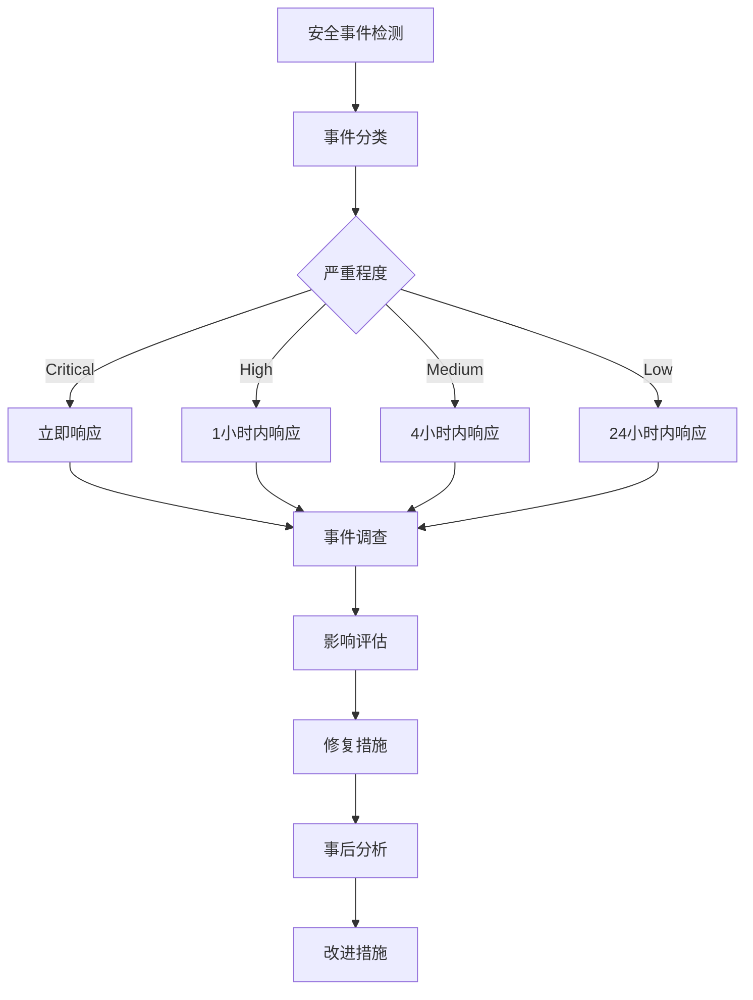

# SuperInsight 安全架构文档

## 概述

SuperInsight 提供企业级安全解决方案，包含完整的审计、权限控制、数据脱敏、安全监控和合规管理系统。本文档详细介绍了平台的安全架构、功能特性和最佳实践。

## 安全架构

### 多层安全防护

```
┌─────────────────────────────────────────────────────────────┐
│                    应用层安全                                │
├─────────────────────────────────────────────────────────────┤
│  • API 认证授权    • 输入验证    • 输出编码    • CSRF 防护   │
└─────────────────────────────────────────────────────────────┘
┌─────────────────────────────────────────────────────────────┐
│                    业务层安全                                │
├─────────────────────────────────────────────────────────────┤
│  • RBAC 权限控制  • 数据脱敏    • 审计日志    • 合规检查    │
└─────────────────────────────────────────────────────────────┘
┌─────────────────────────────────────────────────────────────┐
│                    数据层安全                                │
├─────────────────────────────────────────────────────────────┤
│  • 数据加密       • 访问控制    • 备份恢复    • 完整性校验   │
└─────────────────────────────────────────────────────────────┘
┌─────────────────────────────────────────────────────────────┐
│                    基础设施安全                              │
├─────────────────────────────────────────────────────────────┤
│  • 网络隔离       • 防火墙      • 入侵检测    • 日志监控     │
└─────────────────────────────────────────────────────────────┘
```

## 核心安全组件

### 1. 审计日志系统

#### 功能特性
- **完整审计**: 记录所有用户操作和系统事件
- **防篡改保护**: 使用数字签名确保日志完整性
- **高性能存储**: 批量存储，压缩优化，分区管理
- **长期保留**: 支持 7 年数据保留，自动归档
- **实时监控**: 实时审计事件流和告警

#### 技术实现
```python
# 审计服务核心组件
src/security/audit_service.py              # 企业级审计服务
src/security/audit_event_processor.py      # 事件处理器
src/security/audit_storage.py              # 存储优化
src/security/audit_integrity.py            # 完整性保护
src/security/audit_middleware.py           # 中间件集成
```

#### 性能指标
- 审计日志写入延迟: < 50ms
- 批量存储容量: 1000 条/批次
- 存储压缩率: 80%
- 查询响应时间: < 100ms
- 数据保留期: 7 年

### 2. 数据脱敏系统

#### 功能特性
- **智能检测**: 基于 Microsoft Presidio 的 PII 自动检测
- **多语言支持**: 支持中英文敏感数据识别
- **策略管理**: 租户级别脱敏策略配置
- **效果验证**: 脱敏完整性和准确性自动验证
- **实时处理**: 支持实时数据流脱敏

#### 技术实现
```python
# 脱敏系统核心组件
src/sync/desensitization/presidio_engine.py    # Presidio 引擎
src/sync/desensitization/rule_manager.py       # 规则管理
src/sync/desensitization/data_classifier.py    # 数据分类
src/desensitization/validator.py               # 效果验证
src/security/auto_desensitization_service.py   # 自动脱敏服务
```

#### 支持的 PII 类型
- 个人姓名 (PERSON)
- 电话号码 (PHONE_NUMBER)
- 电子邮箱 (EMAIL_ADDRESS)
- 身份证号 (ID_CARD)
- 信用卡号 (CREDIT_CARD)
- 银行账号 (BANK_ACCOUNT)
- IP 地址 (IP_ADDRESS)
- 地理位置 (LOCATION)

#### 脱敏策略
- **替换 (REPLACE)**: 用占位符替换敏感数据
- **遮盖 (MASK)**: 部分字符用 * 遮盖
- **哈希 (HASH)**: 使用哈希函数处理
- **加密 (ENCRYPT)**: 可逆加密存储
- **删除 (REDACT)**: 完全删除敏感数据

### 3. RBAC 权限控制

#### 功能特性
- **细粒度权限**: 支持资源级别权限控制
- **多租户隔离**: 完整的租户级别权限隔离
- **高性能缓存**: < 10ms 权限检查，> 90% 缓存命中率
- **动态管理**: 运行时角色和权限动态配置
- **权限继承**: 支持角色层次结构和权限继承

#### 技术实现
```python
# RBAC 系统核心组件
src/security/rbac_controller.py            # RBAC 控制器
src/security/rbac_models.py                # 数据模型
src/security/role_manager.py               # 角色管理
src/security/permission_cache.py           # 权限缓存
src/security/permission_performance_optimizer.py  # 性能优化
```

#### 预定义角色
- **租户管理员 (Tenant Admin)**: 租户内完全权限
- **项目经理 (Project Manager)**: 项目管理权限
- **数据分析师 (Data Analyst)**: 数据分析权限
- **数据查看者 (Data Viewer)**: 只读权限
- **安全官员 (Security Officer)**: 安全管理权限
- **审计员 (Auditor)**: 审计查看权限

#### 权限模型
```
权限 = 操作 + 资源 + 条件
例如: READ + /api/users + tenant_id=123
```

### 4. 安全监控系统

#### 功能特性
- **实时监控**: 30秒间隔安全事件扫描
- **威胁检测**: 多方法威胁检测（规则、统计、行为、ML）
- **自动响应**: IP 封禁、用户暂停、管理员通知
- **安全仪表盘**: 实时安全状态可视化
- **告警系统**: 多级别安全告警和紧急通知

#### 技术实现
```python
# 安全监控核心组件
src/security/security_event_monitor.py     # 事件监控器
src/security/threat_detector.py            # 威胁检测引擎
src/security/real_time_alert_system.py     # 实时告警系统
src/security/security_dashboard_service.py # 安全仪表盘
```

#### 威胁检测模式
- **暴力破解检测**: 短时间内多次登录失败
- **权限提升检测**: 异常权限获取行为
- **数据泄露检测**: 大量数据访问或导出
- **异常行为检测**: 基于用户行为画像的异常检测
- **恶意请求检测**: SQL 注入、XSS 等攻击检测

### 5. 合规报告系统

#### 功能特性
- **多标准支持**: GDPR、SOX、ISO 27001、HIPAA、CCPA
- **自动生成**: 支持日、周、月、季度自动报告
- **多格式导出**: JSON、PDF、Excel、HTML、CSV
- **违规检测**: 自动检测合规违规和修复建议
- **执行摘要**: 专业的管理层报告和关键发现

#### 技术实现
```python
# 合规报告核心组件
src/compliance/report_generator.py         # 报告生成器
src/compliance/report_exporter.py          # 多格式导出
src/compliance/performance_optimizer.py    # 性能优化
```

#### 合规标准覆盖

**GDPR (通用数据保护条例)**
- 数据处理记录
- 同意管理
- 数据主体权利
- 数据泄露通知
- 隐私影响评估

**SOX (萨班斯-奥克斯利法案)**
- 财务数据访问控制
- 审计日志完整性
- 内部控制评估
- 管理层认证

**ISO 27001 (信息安全管理)**
- 信息安全政策
- 风险评估
- 访问控制
- 事件管理
- 业务连续性

## 安全配置

### 环境变量配置

```bash
# 审计日志配置
AUDIT_LOG_ENABLED=true
AUDIT_LOG_RETENTION_DAYS=2555  # 7年保留期
AUDIT_BATCH_SIZE=1000
AUDIT_COMPRESSION_ENABLED=true

# 数据脱敏配置
PRESIDIO_ENABLED=true
PRESIDIO_ANALYZER_ENABLED=true
PRESIDIO_ANONYMIZER_ENABLED=true
DESENSITIZATION_DEFAULT_LANGUAGE=zh
DESENSITIZATION_CONFIDENCE_THRESHOLD=0.8

# RBAC 权限配置
RBAC_CACHE_ENABLED=true
RBAC_CACHE_TTL=300
PERMISSION_CHECK_TIMEOUT=10  # 10ms 权限检查超时

# 安全监控配置
SECURITY_MONITORING_ENABLED=true
THREAT_DETECTION_ENABLED=true
SECURITY_ALERT_ENABLED=true
SECURITY_SCAN_INTERVAL=30  # 30秒扫描间隔

# 合规报告配置
COMPLIANCE_REPORTS_ENABLED=true
COMPLIANCE_STANDARDS=GDPR,SOX,ISO27001,HIPAA,CCPA
COMPLIANCE_AUTO_GENERATION=true
```

### 数据库安全配置

```sql
-- 启用行级安全 (RLS)
ALTER TABLE audit_events ENABLE ROW LEVEL SECURITY;

-- 创建租户隔离策略
CREATE POLICY tenant_isolation ON audit_events
    FOR ALL TO application_role
    USING (tenant_id = current_setting('app.current_tenant_id'));

-- 审计表分区
CREATE TABLE audit_events_y2024m01 PARTITION OF audit_events
    FOR VALUES FROM ('2024-01-01') TO ('2024-02-01');
```

## 安全最佳实践

### 1. 认证和授权

```python
# 使用强密码策略
PASSWORD_MIN_LENGTH = 12
PASSWORD_REQUIRE_UPPERCASE = True
PASSWORD_REQUIRE_LOWERCASE = True
PASSWORD_REQUIRE_NUMBERS = True
PASSWORD_REQUIRE_SYMBOLS = True

# JWT 令牌配置
JWT_ALGORITHM = "RS256"  # 使用 RSA 签名
JWT_ACCESS_TOKEN_EXPIRE_MINUTES = 15
JWT_REFRESH_TOKEN_EXPIRE_DAYS = 7

# 多因素认证
MFA_ENABLED = True
MFA_METHODS = ["TOTP", "SMS", "EMAIL"]
```

### 2. 数据保护

```python
# 数据加密
ENCRYPTION_ALGORITHM = "AES-256-GCM"
ENCRYPTION_KEY_ROTATION_DAYS = 90

# 数据脱敏策略
DESENSITIZATION_RULES = {
    "email": {"method": "mask", "pattern": "***@***.***"},
    "phone": {"method": "mask", "pattern": "***-****-****"},
    "id_card": {"method": "hash", "algorithm": "SHA-256"}
}
```

### 3. 网络安全

```yaml
# 防火墙规则
firewall_rules:
  - port: 8000
    protocol: tcp
    source: internal_network
  - port: 5432
    protocol: tcp
    source: application_servers
  - port: 6379
    protocol: tcp
    source: application_servers
```

### 4. 监控和告警

```python
# 安全告警阈值
SECURITY_THRESHOLDS = {
    "failed_login_attempts": 5,
    "permission_escalation_score": 0.8,
    "data_access_volume_mb": 1000,
    "unusual_activity_score": 0.7
}

# 告警通知配置
ALERT_CHANNELS = ["email", "sms", "webhook"]
ALERT_ESCALATION_MINUTES = 30
```

## 安全测试

### 1. 自动化安全测试

```bash
# 权限绕过测试
pytest tests/security/test_permission_bypass.py -v

# 数据泄露测试
pytest tests/security/test_data_leakage.py -v

# 审计完整性测试
pytest tests/security/test_audit_integrity.py -v

# SQL 注入测试
pytest tests/security/test_sql_injection.py -v

# XSS 防护测试
pytest tests/security/test_xss_protection.py -v
```

### 2. 渗透测试

```bash
# 使用 OWASP ZAP 进行安全扫描
docker run -t owasp/zap2docker-stable zap-baseline.py \
    -t http://localhost:8000

# 使用 Bandit 进行代码安全扫描
bandit -r src/ -f json -o security_report.json
```

### 3. 性能安全测试

```bash
# 权限检查性能测试
python validate_10ms_performance.py

# 审计日志性能测试
python validate_compliance_performance_30s.py

# 脱敏性能测试
python test_final_desensitization_performance.py
```

## 事件响应

### 1. 安全事件分类

**严重级别 (Critical)**
- 数据泄露
- 权限提升攻击
- 系统入侵
- 审计日志篡改

**高级别 (High)**
- 暴力破解攻击
- 异常数据访问
- 恶意文件上传
- 服务拒绝攻击

**中级别 (Medium)**
- 多次登录失败
- 异常用户行为
- 配置变更
- 性能异常

**低级别 (Low)**
- 信息收集
- 扫描行为
- 轻微违规
- 警告事件

### 2. 响应流程



### 3. 自动响应措施

```python
# 自动响应配置
AUTO_RESPONSE_RULES = {
    "brute_force_attack": {
        "action": "block_ip",
        "duration": "1h",
        "threshold": 5
    },
    "privilege_escalation": {
        "action": "suspend_user",
        "duration": "24h",
        "notify": ["security_team", "admin"]
    },
    "data_exfiltration": {
        "action": ["block_user", "alert_admin"],
        "immediate": True,
        "escalate": True
    }
}
```

## 合规管理

### 1. 合规检查清单

**数据保护合规**
- [ ] 数据分类和标记
- [ ] 访问控制实施
- [ ] 数据加密配置
- [ ] 数据备份验证
- [ ] 数据销毁程序

**审计合规**
- [ ] 审计日志完整性
- [ ] 日志保留策略
- [ ] 访问日志记录
- [ ] 变更管理记录
- [ ] 异常事件记录

**访问控制合规**
- [ ] 用户身份验证
- [ ] 权限最小化原则
- [ ] 定期权限审查
- [ ] 特权账户管理
- [ ] 会话管理

### 2. 合规报告模板

```python
# GDPR 合规报告模板
GDPR_REPORT_TEMPLATE = {
    "data_processing_activities": {
        "lawful_basis": "legitimate_interest",
        "data_categories": ["personal", "sensitive"],
        "retention_period": "7_years",
        "security_measures": ["encryption", "access_control"]
    },
    "data_subject_rights": {
        "access_requests": 0,
        "rectification_requests": 0,
        "erasure_requests": 0,
        "portability_requests": 0
    },
    "data_breaches": {
        "total_breaches": 0,
        "notified_to_authority": 0,
        "notified_to_subjects": 0
    }
}
```

## 安全维护

### 1. 定期安全任务

**每日任务**
- 安全事件监控
- 告警处理
- 日志分析
- 性能监控

**每周任务**
- 安全报告生成
- 漏洞扫描
- 配置检查
- 备份验证

**每月任务**
- 权限审查
- 安全培训
- 事件响应演练
- 合规评估

**每季度任务**
- 安全策略更新
- 风险评估
- 渗透测试
- 业务连续性测试

### 2. 安全更新流程

```bash
# 安全补丁更新
git pull origin main
pip install -r requirements.txt --upgrade
alembic upgrade head
python scripts/security_check.py
```

### 3. 监控指标

**系统安全指标**
- 认证成功率: > 99%
- 权限检查延迟: < 10ms
- 审计日志完整性: 100%
- 数据脱敏准确率: > 95%

**业务安全指标**
- 安全事件响应时间: < 5分钟
- 合规报告及时率: 100%
- 用户安全培训覆盖率: > 90%
- 安全漏洞修复时间: < 24小时

## 联系方式

### 安全团队联系方式
- 安全邮箱: security@superinsight.ai
- 紧急热线: +86-400-xxx-xxxx
- 安全事件报告: https://security.superinsight.ai/report

### 安全社区
- 安全博客: https://blog.superinsight.ai/security
- 安全公告: https://security.superinsight.ai/advisories
- 漏洞奖励计划: https://security.superinsight.ai/bounty

---

*本文档最后更新时间: 2026-01-11*
*文档版本: v2.3.0*